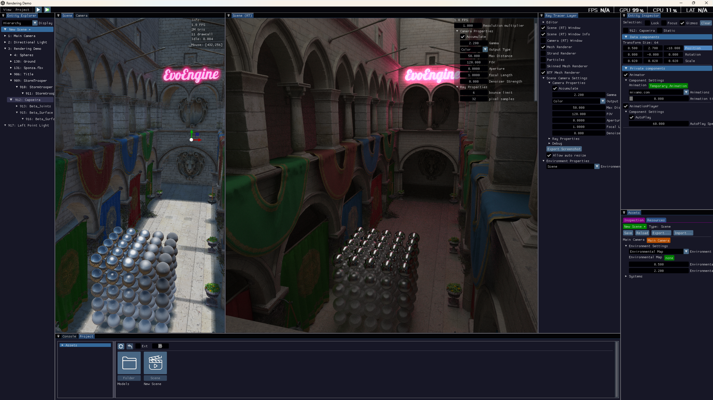
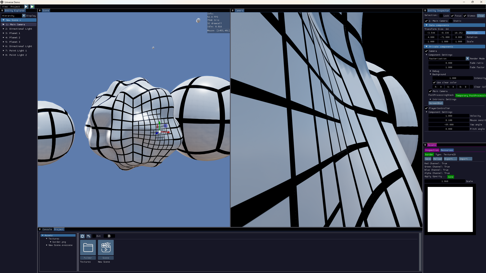
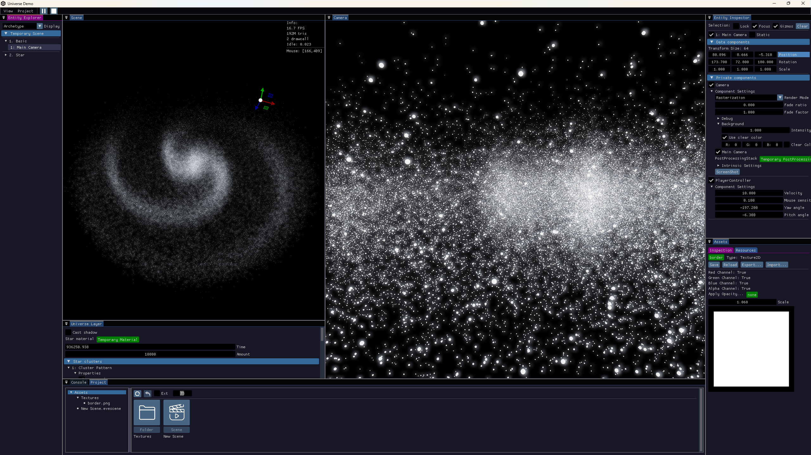

# EvoEngine


EvoEngine is a C++17 research framework for interactive simulation, digital forestry, digital agriculture, synthetic dataset generation, and Vulkan rendering. The repository is built around a general-purpose SDK, compile-time domain Services, and a new runtime package layer. The SDK provides the application runtime, editor, ECS, renderer, asset system, serialization, and automation hooks; Services add research workflows at build time; runtime packages are shared-library modules that can be loaded while the app is running.

Windows is the primary development platform. Linux builds are supported for the core stack, while several Services are Windows-only or require optional SDKs.


## 1. EvoEngine SDK

The SDK is the foundation of the framework. It lives in `EvoEngine_SDK` and is responsible for the reusable engine/runtime systems that Services and applications build on.

### SDK Responsibilities

The SDK provides:

- application lifecycle and layer composition
- scene and entity management
- a hybrid ECS with data components and private components
- systems, transforms, hierarchy, prefabs, and scene cloning
- project, folder, file, asset, and metadata management
- YAML-based serialization and type registration
- an ImGui editor layer for scene, entity, asset, console, and inspector workflows
- Vulkan platform setup and rendering infrastructure
- global geometry and texture storage
- material, mesh, camera, light, render texture, and post-processing assets/components
- job scheduling, input events, and frame/fixed-step timing
- resource copying and shader include registration support for Services
- runtime package loading, guarded unloading/reloading, and package-owned private component registration

### Repository Layout

| Path | Purpose |
| --- | --- |
| `EvoEngine_SDK` | Core runtime, ECS, editor, renderer, assets, serialization, jobs, input, and utilities. |
| `EvoEngine_Services` | Build-time domain modules that extend the SDK and are linked into apps/Python bindings. |
| `EvoEngine_Packages` | Runtime package shared-library modules loaded from `Packages` folders. |
| `EvoEngine_App` | Executable apps, shared demo setup headers, app entry points, and app resources/configuration. |
| `PythonBinding` | pybind11 modules for scripted workflows. |
| `Resources` | Demo projects, screenshots, textures, and sample assets. |
| `Extern` | Vendored third-party libraries and submodules. |
| `cmake` | CMake helper modules. |

### Application Model

An EvoEngine app is assembled by pushing layers before initialization. A typical interactive app uses:

- `RenderLayer` for Vulkan rendering, render instance preparation, and external render callbacks.
- `WindowLayer` for GLFW windows, input callbacks, resize handling, and presentation.
- `EditorLayer` for ImGui tools, scene views, entity hierarchy, inspectors, asset browser, and console.
- Runtime package layers such as `EcoSysLabLayer`, `SorghumLayer`, and `UniverseLayer`.

The main loop runs in phases: input/platform update, project update, transform graph calculation, fixed update, scene update, render preparation, late update, render execution, and window presentation. Editor play mode clones the start scene for runtime simulation, then restores the project scene when playback stops.

### ECS and Scene Model

EvoEngine uses two complementary component types:

| Component type | Use for |
| --- | --- |
| Data components | Plain standard-layout structs stored by archetype/chunk. Use them for high-volume simulation and parallel `Scene::ForEach` iteration. |
| Private components | Object-style components with lifecycle hooks, serialization, asset references, editor inspection, and per-entity behavior. |

Scenes own entity metadata, hierarchy, data component storage, private component storage, systems, environment state, and the main camera reference. Scene APIs cover entity creation/destruction, parenting, enable/static/name state, data component access, private component access, systems, queries, cloning, serialization, and prefab conversion.

Use data components when memory layout and parallel iteration matter most. Use private components when the feature needs editor UI, lifecycle methods, polymorphism, serialized state, or asset references.

### Assets, Projects, and Serialization

Assets are handle-based and are managed by the asset, file, and project managers. Projects use `.eveproj` files and asset sidecars such as `.evefilemeta` and `.evefoldermeta`. Asset references serialize by handle and type name, then resolve through the asset manager.

Persistent engine types must be registered with the serialization system. New persistent types usually need:

- a type registration such as `AssetRegistration`, `PrivateComponentRegistration`, `DataComponentRegistration`, or system registration
- `Serialize` and `Deserialize`
- `OnInspect` when editor editing is useful
- `CollectAssetRef` and `Relink` when the type stores `AssetRef`, `EntityRef`, or component/entity handles

### Rendering

The SDK renderer is Vulkan-based and centered on `RenderLayer`. The renderer includes deferred and forward paths, shadow maps, PBR materials, environment lighting, skyboxes, render textures, editor cameras, gizmos, mesh/skinned/instanced/particle/strand draw paths, and optional meshlet, indirect, and ray tracing support where available.

Scene components describe rendering intent. Render instance storage converts scene state into GPU-friendly material, instance, camera, light, and environment buffers. Geometry and texture storage keep mesh and texture resources globally available to render passes.

Services can extend rendering through `RenderLayer` callbacks for shadow maps, deferred rendering, forward rendering, and custom render instance registration.

### Jobs, Input, and Time

The SDK job system supports scheduled and immediate parallel work. ECS iteration helpers use jobs to process chunks in parallel. The runtime owns a general worker pool plus named service executors for main-thread callbacks, asset IO, GPU resource work, future rendering work, and background tasks. `JobSystem` and `Jobs` remain compatibility facades over this engine-owned `TaskRuntime` boundary so backend experiments can happen behind the same API.

GPU upload/finalization work that is not full frame rendering is routed through the platform-owned `GpuService` instance on a dedicated GPU executor. `Platform::ImmediateSubmit` forwards into that service, and buffers expose async upload/readback entry points for callers that can keep CPU work moving while GPU transfer work completes. Geometry storage schedules mesh, skinned mesh, and strand uploads on this path, uses dirty subrange uploads for compacted/appended geometry data, and publishes draw ranges only after those uploads complete. The application frame loop, `RenderLayer::RenderAll`, window rendering, and presentation still run on the main thread; the render executor is reserved for future render-thread work.

Interactive project asset loading now dispatches scanned assets as an `AssetManager` batch instead of resolving one pending asset per frame. The asset-service path owns per-handle in-flight state, progress snapshots, and blocking sync access, so concurrent requests wait for the first loader instead of creating duplicate asset instances. Assets can opt into staged async loading by producing a CPU-only payload on the asset-IO executor and applying it later on the bounded main-thread finalization lane. GPU-backed staged assets can also register GPU readiness work; those loads remain `GpuPending` until the tracked GPU jobs complete, and sync access blocks until the asset is fully ready. `Texture2D` uses this path so staged pixel decoding is separated from asynchronous GPU upload, and runtime texture data updates use the same GPU-service-backed upload path while readback/export waits for pending texture GPU work. SDK staged assets also include shader/JSON source assets, scene and native prefab YAML, strands, point clouds, and the SDK YAML-backed render assets that deserialize through the default `IAsset` path. Legacy non-staged paths, especially imported model prefab formats that still run through Assimp and create engine objects during import, continue to finalize on the main thread. `ApplicationInitializationSettings::load_project_assets` can disable headless project asset preloading for tests and tools that want to request assets explicitly. Input is routed from GLFW callbacks through the engine input system and layer event hooks. Timing utilities track frame delta time, fixed timestep state, and update counters.

### Applications

| Target | Purpose |
| --- | --- |
| `EvoEngineLauncher` | Project launcher for opening or creating projects before starting the editor. |
| `EvoEngineEditor` | Generic project-required editor shell launched with a `.eveproj` path. |
| `DemoApp` | General renderer/framework demo with multiple Service registrations. |
| `EcoSysLabApp` | Interactive digital forestry and ecosystem workflow. |
| `DigitalAgricultureApp` | Interactive sorghum and agriculture workflow. |
| `LogGradingApp` | Log grading workflow; LogGrading and LogScanning features are supplied by runtime packages. |
| `TreeDataGeneratorApp` | Batch-oriented tree dataset generation. |
| `SorghumDataGeneratorApp` | Batch-oriented sorghum dataset generation. |

`.eveproj` files can carry launch metadata used by `EvoEngineLauncher` and `EvoEngineEditor`: `application_name`,
`preferred_editor`, and `startup_runtime_packages`. The generic editor reads package names from this metadata before
project assets load, so package-backed projects can be opened from the launcher without hardcoding an app-specific entry
point. Launcher-created projects write this metadata from the selected template before the editor starts.

### Python Bindings

`PythonBinding` builds pybind11 modules for automation:

- core Python scripts and bindings that do not depend on runtime package C++ APIs

Package-specific Python C++ APIs for EcoSysLab and DigitalAgriculture are currently disabled while those domains move to runtime packages. Example scripts live in `PythonBinding`; package-level Python APIs should be added through a dedicated dynamic package interface later.

### Services and Runtime Packages

EvoEngine now separates two extension models:

| Extension type | Folder | Build/runtime model | Use for |
| --- | --- | --- | --- |
| Service | `EvoEngine_Services/<Name>` | Static library selected by CMake options such as `EVOENGINE_ENABLE_CudaModule_SERVICE` | Build-time modules that apps or packages link against directly. |
| Runtime package | `EvoEngine_Packages/<Name>` | DLL/shared library selected by CMake options such as `EVOENGINE_ENABLE_<Name>_PACKAGE` and loaded from a `Packages` runtime folder | Domain features that can be rebuilt, loaded, unloaded, or reloaded independently from the app. |

When `EVOENGINE_ENABLE_RUNTIME_PACKAGES` is `ON`, the SDK builds as a shared library so apps, services, Python bindings, and runtime packages share the same runtime registries. Runtime packages export `EvoEnginePackageGetDescriptor`, `EvoEnginePackageLoad`, and `EvoEnginePackageUnload`. Packages may also export `EvoEnginePackageRegisterTypes` so RTTI/reflection types are registered before the normal load callback runs. A package can register private components, assets, data components, systems, and layers through `PackageRegistrar`.

### Build Requirements

Clone with submodules:

```bash
git clone --recursive https://github.com/edisonlee0212/EvoEngine.git
cd EvoEngine
```

If the repository was cloned without submodules:

```bash
git submodule update --init --recursive
```

Windows requirements:

- Visual Studio 2026 with Desktop development with C++
- CMake
- Vulkan SDK

Generate the Visual Studio solution:

```bat
python Scripts\build_project.py
```

Build and install runnable app binaries:

```bat
python Scripts\install_apps.py
python Scripts\install_apps.py --config Debug
```

Rebuild one runtime package in the build tree:

```bat
cmake --build out/build/vs2026-x64 --config RelWithDebInfo --target EcoSysLabPackage
cmake --build out/build/vs2026-x64 --config Debug --target DigitalAgriculturePackage
```

Linux requirements:

- `clang-14`
- `cmake`
- `ninja-build`
- `libwayland-dev`
- `libxkbcommon-dev`
- `xorg-dev`
- Vulkan SDK from LunarG
- Python development headers, currently expected around Python 3.12 for the provided setup

Linux build:

```bash
cmake -S . -B out/build/linux-RelWithDebInfo -DCMAKE_BUILD_TYPE=RelWithDebInfo -DCMAKE_INSTALL_PREFIX=out/install/linux-RelWithDebInfo
cmake --build out/build/linux-RelWithDebInfo
cmake --install out/build/linux-RelWithDebInfo
```

Useful scripts:

```bash
python Scripts/test.py
python Scripts/test.py --all
python Scripts/format_cpp.py
python Scripts/format_cpp.py --check
```

`python Scripts/test.py` is the local render test runner. By default it builds the `EvoEngine_RenderTests` aggregate target and runs render/GPU-labeled tests, including the render golden-image comparison and a `DemoApp` executable smoke test that waits for the rendering demo project to finish loading, enters play mode, and renders 100 frames. Visual artifacts are written under `out/test-artifacts/latest`, and PSNR/SSIM are reported for the golden-image comparison. Use `--all` to run every CTest test in the local build tree.

GitHub Actions are limited to repository-wide format checks and platform compilation checks. Rendering tests are intentionally local-only because they require a Vulkan-capable GPU environment and produce visual artifacts for inspection.

Build outputs are generated under `out/build/<platform>-<config>/`. App binaries are produced under the `EvoEngine_App` build directory and Python modules are produced under the `PythonBinding` build directory. Runtime packages are copied under the app runtime `Packages` folder. Post-build steps still copy engine resources, Service resources, runtime libraries (`.dll` on Windows, `.so` on Linux), PDBs when available, runtime packages, and `imgui.ini` beside build-tree binaries for fast local development.

CMake install provides a cleaner runtime deployment tree:

```text
out/install/vs2026-x64/bin/
out/install/vs2026-x64/bin/Packages/
out/install/vs2026-x64/python/
```

The `bin` folder contains installed app executables plus their runtime libraries, PDBs when available, and resources. Runtime package libraries install under `bin/Packages`. The `python` folder contains installed Python extension modules, Python scripts, and the same runtime library/resource payload needed for imports and scripted workflows.

### VSCode Build

VSCode on Windows should use `CMakePresets.json` through the CMake Tools extension. The preset file intentionally keeps only the two install build presets used for normal Visual Studio development:

- `install-vs2026-x64-Debug`
- `install-vs2026-x64-RelWithDebInfo`

Select the `vs2026-x64` configure preset, then choose one of those install build presets. They build the selected configuration and deploy the runtime payload to `out/install/vs2026-x64`.

The Visual Studio generator writes app executables to:

```text
out/build/vs2026-x64/EvoEngine_App/<Config>/
```

Runtime package libraries are copied to the matching app `Packages` directory, for example:

```text
out/build/vs2026-x64/EvoEngine_App/RelWithDebInfo/Packages/
```

To rebuild one runtime package without rebuilding every app, build the package target named `<PackageName>Package`. The editor Runtime Package Manager can also run this CMake target directly for packages loaded from the build-tree `Packages` directory. When the editor is running from an installed app runtime, the Build button uses the matching `out/build/<preset>` tree and copies the rebuilt package manifest, library, and PDB back into `bin/Packages`.

From a terminal, use:

```bat
python Scripts\build_project.py
python Scripts\install_apps.py
```

After install, app executables are under:

```text
out/install/vs2026-x64/bin/
```

Runtime package libraries are under:

```text
out/install/vs2026-x64/bin/Packages/
```

Python bindings and scripts are under:

```text
out/install/vs2026-x64/python/
```

If CMake is configured with a Visual Studio generator instead, it will create `.sln` and `.vcxproj` files. Those files are project files, not final executables. To produce `.exe` files from that generator, the generated solution still needs to be built with Visual Studio, MSBuild, or `cmake --build <build-dir> --config Debug`.

On Linux, configure directly with CMake and install to a separate tree:

```bash
cmake -S . -B out/build/linux-RelWithDebInfo -DCMAKE_BUILD_TYPE=RelWithDebInfo -DCMAKE_INSTALL_PREFIX=out/install/linux-RelWithDebInfo
cmake --build out/build/linux-RelWithDebInfo
cmake --install out/build/linux-RelWithDebInfo
```

Linux runtime libraries are deployed as `.so` files beside the installed apps and Python modules.

### SDK Extension Guide

When adding new work:

- Add a private component when behavior belongs to an entity and needs lifecycle hooks, editor UI, serialization, or asset references.
- Add data components when the feature is high-volume and benefits from chunked ECS iteration.
- Add a system when behavior should run over a scene independently of one component instance.
- Add an asset when data should be reusable, referenceable, and stored in projects.
- Add a layer when behavior is global to the application or needs top-level UI/render/input hooks.
- Add a service when the feature is a build-time dependency and should remain outside the SDK.
- Add a runtime package when the feature should be loaded, unloaded, or rebuilt independently from a running app.
- Add a Python binding when a workflow should run from scripts.

### Runtime Package Development

Runtime packages live under `EvoEngine_Packages`. The package CMake entry scans package folders automatically, reads optional metadata from `PackageInfo.cmake`, creates an `EVOENGINE_ENABLE_<Name>_PACKAGE` option, and builds a shared library target named `<Name>Package` by default. Disable individual package targets with `EVOENGINE_ENABLE_<Name>_PACKAGE=OFF` when a build should skip them.

Apps do not load runtime packages by default. Set `ApplicationInitializationSettings::enable_runtime_packages = true` and add names to `ApplicationInitializationSettings::startup_runtime_packages`, declare `startup_runtime_packages` in a project `.eveproj`, or call `PackageManager::Load/LoadAll` from runtime/editor tooling when a workflow needs additional package functionality.

Headless tools and focused tests that only need project scanning or asset metadata can set `ApplicationInitializationSettings::load_default_resources = false` and `ApplicationInitializationSettings::load_project_start_scene = false` to avoid creating render defaults or attaching a scene during initialization.

Package dependencies are declared with `EVOENGINE_PACKAGE_DEPENDS` in `PackageInfo.cmake`. CMake builds dependencies first and emits a sidecar `.evepackage` manifest beside each package binary so the runtime can discover and load dependencies before opening a package DLL/shared library.

A package must export the descriptor/load/unload entrypoints. Packages that own RTTI/reflection types should also export `EvoEnginePackageRegisterTypes`:

```cpp
EvoEnginePackageGetDescriptor
EvoEnginePackageRegisterTypes
EvoEnginePackageLoad
EvoEnginePackageUnload
```

Use `EvoEnginePackageRegisterTypes` and the provided `PackageRegistrar` to register package-owned RTTI/reflection types:

```cpp
registrar.RegisterPrivateComponent<MyComponent>("MyComponent");
registrar.RegisterAsset<MyAsset>("MyAsset", {".myasset"});
registrar.RegisterDataComponent<MyData>("MyData");
registrar.RegisterSystem<MySystem>("MySystem");
registrar.RegisterLayer<MyLayer>("My Layer");
```

Package unloading is guarded. Load/reload/unload is refused while the app is playing, paused, or stepping, and reload/unload is also refused while package-owned private component instances, package-created objects, or dependent runtime packages still exist. On Windows, packages are loaded from a shadow copy, so the original DLL can usually be rebuilt while the app process remains open. For build-tree iteration, click `Build` for the package in the editor Runtime Package Manager, stop play mode, then click `Reload` for the loaded package.

### License

This repository is licensed under the Creative Commons Attribution-NonCommercial 4.0 International license. See `LICENSE` for the full text.

## 2. Service Documentation

Service and runtime package documentation is split into separate Markdown files so each module can grow independently without turning the README into a wall of details.

| Service | Status | Documentation |
| --- | --- | --- |
| CudaModule | Present but disabled by default | [EvoEngine_Services/CudaModule/README.md](EvoEngine_Services/CudaModule/README.md) |
| PhysXPhysics | Present but disabled in its CMake file | [EvoEngine_Services/PhysXPhysics/README.md](EvoEngine_Services/PhysXPhysics/README.md) |

| Runtime Package | Status | Documentation |
| --- | --- | --- |
| Universe | Built by default | [EvoEngine_Packages/Universe/README.md](EvoEngine_Packages/Universe/README.md) |
| BillboardClouds | Built by default | [EvoEngine_Packages/BillboardClouds/README.md](EvoEngine_Packages/BillboardClouds/README.md) |
| EcoSysLab | Built by default; depends on BillboardClouds | [EvoEngine_Packages/EcoSysLab/README.md](EvoEngine_Packages/EcoSysLab/README.md) |
| DigitalAgriculture | Built by default; depends on EcoSysLab | [EvoEngine_Packages/DigitalAgriculture/README.md](EvoEngine_Packages/DigitalAgriculture/README.md) |
| DatasetGeneration | Built by default; depends on EcoSysLab and DigitalAgriculture | [EvoEngine_Packages/DatasetGeneration/README.md](EvoEngine_Packages/DatasetGeneration/README.md) |
| TextureBaking | Built by default on Windows | [EvoEngine_Packages/TextureBaking/README.md](EvoEngine_Packages/TextureBaking/README.md) |
| MeshRepair | Built by default on Windows | [EvoEngine_Packages/MeshRepair/README.md](EvoEngine_Packages/MeshRepair/README.md) |
| Gpr | Built by default on Windows | [EvoEngine_Packages/Gpr/README.md](EvoEngine_Packages/Gpr/README.md) |
| LogGrading | Built by default on Windows; requires EcoSysLab | [EvoEngine_Packages/LogGrading/README.md](EvoEngine_Packages/LogGrading/README.md) |
| LogScanning | Built by default on Windows; requires EcoSysLab and Pinchot | [EvoEngine_Packages/LogScanning/README.md](EvoEngine_Packages/LogScanning/README.md) |

The Service index is also available at [EvoEngine_Services/README.md](EvoEngine_Services/README.md).
Runtime package documentation is available at [EvoEngine_Packages/README.md](EvoEngine_Packages/README.md).

### Service Build Model

Services are registered from `EvoEngine_Services/CMakeLists.txt`. The registration macro creates an `EVOENGINE_ENABLE_<ServiceName>_SERVICE` option, adds the Service subdirectory, and appends the Service target, include paths, compile definitions, precompiled headers, copied resources, and runtime libraries to the shared EvoEngine build variables.

The common pattern is:

- Service source lives under `EvoEngine_Services/<ServiceName>/include` and `src`
- Service target is a static library named `<ServiceName>Service`
- Service compile definitions are uppercase module names such as `CUDA_MODULE_SERVICE` or `PHYSX_PHYSICS_SERVICE`
- Service resources may be copied from an `Internals` folder
- app targets link against the enabled Service list

For example, configure with `-DEVOENGINE_ENABLE_CudaModule_SERVICE=OFF` to disable a build-time service, or `-DEVOENGINE_ENABLE_EcoSysLab_PACKAGE=OFF` to skip a runtime package and its dependents.

### Demo Projects and Visual Results

Demo projects and visual assets live under `Resources`.

| Area | Preview |
| --- | --- |
| Rasterized rendering |  |
| Ray tracing |  |
| Planet terrain |  |
| Star clusters |  |
| Tree framework |  |
| Tree fracture |  |
| Strand visualization |  |
| Sorghum model |  |
| Sorghum point cloud |  |
| Sorghum environment lighting |  |
| Illumination estimation |  |

### Related Publications

EvoEngine supports research workflows used in digital forestry and digital agriculture. Related work includes:

- [Learning to Reconstruct Botanical Trees from Single Images, SIGGRAPH Asia 2021](https://storage.googleapis.com/pirk.io/projects/single_tree_reconstruction/index.html)
- [Rhizomorph: The Coordinated Function of Shoots and Roots, SIGGRAPH 2023](https://storage.googleapis.com/pirk.io/projects/rhizomorph/index.html)
- [DeepTree: Modeling Trees with Situated Latents, TVCG 2023](https://storage.googleapis.com/pirk.io/projects/deep_tree/index.html)
- [Latent L-systems: Transformer-based Tree Generator, SIGGRAPH 2024](https://dl.acm.org/doi/pdf/10.1145/3627101)
- [Tree-D Fusion: Simulation-Ready Tree Dataset from Single Images with Diffusion Priors, ECCV 2024](https://link.springer.com/chapter/10.1007/978-3-031-72940-9_25)
- [Interactive Invigoration: Volumetric Modeling of Trees with Strands, SIGGRAPH 2024](https://storage.googleapis.com/pirk.io/projects/invigoration/index.html)
- [TreeStructor: Forest Reconstruction With Neural Ranking, TGRS 2025](https://lewkesy.github.io/treestructor/)
- [Stressful Tree Modeling: Breaking Branches with Strands, SIGGRAPH 2025](https://dl.acm.org/doi/10.1145/3721238.3730745)
- [3D reconstruction identifies loci linked to variation in angle of individual sorghum leaves, PeerJ](https://peerj.com/articles/12628/)
- [Sorghum segmentation and leaf counting using in silico trained deep neural model, The Plant Phenome Journal](https://acsess.onlinelibrary.wiley.com/doi/pdf/10.1002/ppj2.70002)
- [PlantSegNet: 3D point cloud instance segmentation of nearby plant organs with identical semantics, Computers and Electronics in Agriculture](https://www.sciencedirect.com/science/article/abs/pii/S0168169924003132)
- [Woodstock](https://jango6324.github.io/woodstock/)
