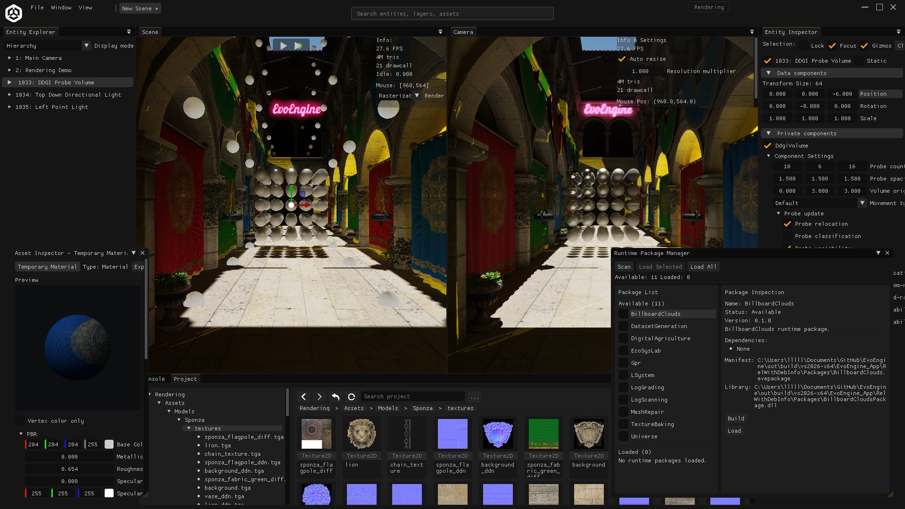
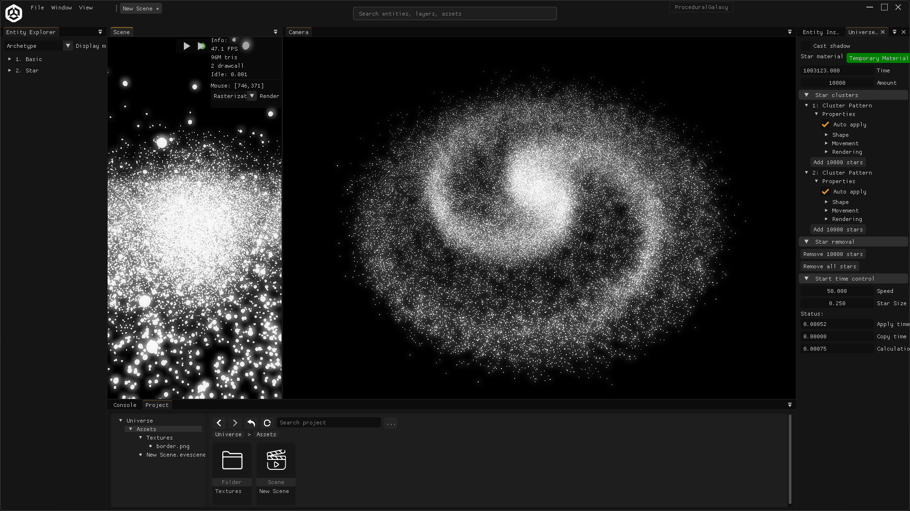
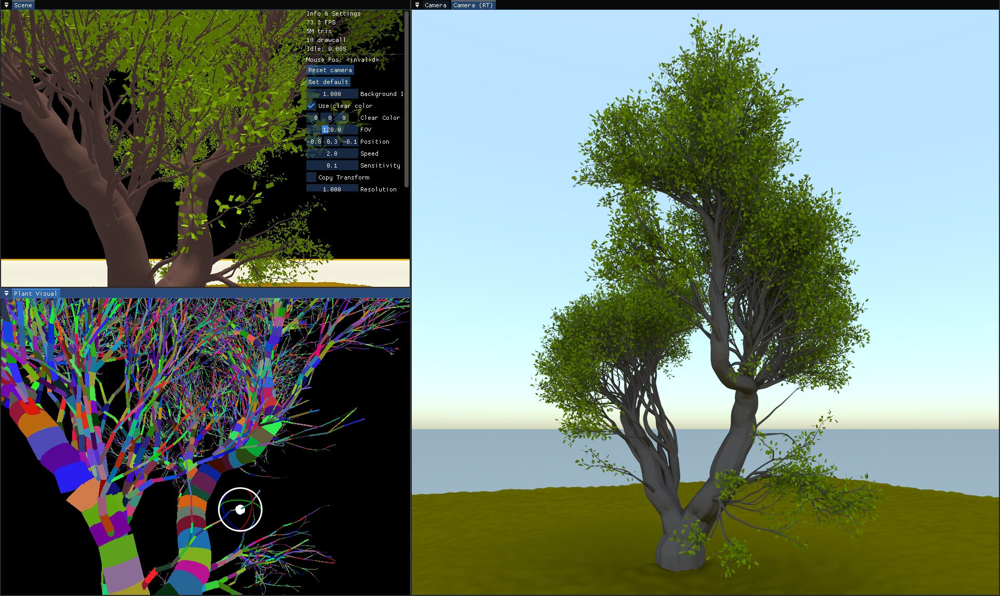
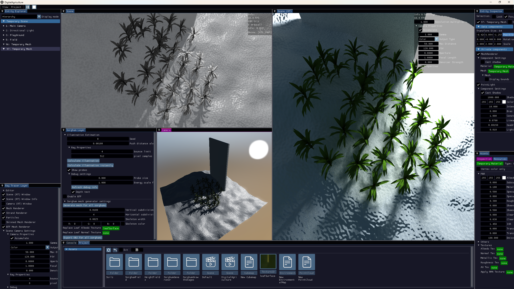

# EvoEngine


EvoEngine is a C++17 research framework for interactive simulation, digital forestry, digital agriculture, synthetic dataset generation, and Vulkan rendering. It includes a reusable SDK, an editor, a project/asset system, Python automation hooks, build-time Services, and runtime packages that can be loaded by the editor or apps.

Windows is the primary development platform. Linux builds are supported for the core stack, while some Services and packages are Windows-only or require optional SDKs.



The rendering demo image is captured from the editor layout prepared by `Scripts/prepare_demos.py`.

## Quick Start

Clone with submodules:

```bash
git clone --recursive https://github.com/edisonlee0212/EvoEngine.git
cd EvoEngine
```

If the repository was cloned without submodules:

```bash
git submodule update --init --recursive
```

On Windows, generate the Visual Studio build tree and install runnable apps:

```bat
python Scripts\build_project.py
python Scripts\install_apps.py
```

Installed app binaries are written to:

```text
out/install/vs2026-x64/bin/
```

Start with `EvoEngineLauncher.exe` to open demo profiles, create projects, or open recent projects. Use
`EvoEngineEditor.exe --project <path-to-project.eveproj>` when launching the editor directly.
Run `python Scripts\prepare_demos.py --editor out\install\vs2026-x64\bin\EvoEngineEditor.exe` to validate and prepare
generated demo resources and missing launcher thumbnails.

For detailed setup, platform requirements, Linux commands, VSCode notes, and install layout, see [docs/building.md](docs/building.md).

## What Is In The Framework?

| Area | Purpose |
| --- | --- |
| SDK | Application lifecycle, layer composition, ECS, scene management, renderer, editor UI, assets, serialization, jobs, input, and utilities. |
| Editor | ImGui-based project editor with scene, entity, asset, console, inspector, runtime package, and playback workflows. |
| Renderer | Vulkan renderer with deferred/forward paths, PBR materials, render textures, editor cameras, shadows, environment lighting, and optional advanced GPU features. |
| Projects and assets | `.eveproj` projects, handle-based assets, file/folder metadata, YAML serialization, staged asset loading, and editor inspectors. |
| Services | Build-time domain modules under `EvoEngine_Services`. |
| Runtime packages | Shared-library modules under `EvoEngine_Packages` that can be loaded, unloaded, rebuilt, and reloaded independently from the app. |
| Python bindings | pybind11 modules and scripts for automation workflows. |

## Documentation

| Topic | Documentation |
| --- | --- |
| Getting started | [docs/getting-started.md](docs/getting-started.md) |
| Build and install | [docs/building.md](docs/building.md) |
| Testing | [docs/testing.md](docs/testing.md) |
| SDK architecture | [docs/architecture.md](docs/architecture.md) |
| Rendering | [docs/rendering.md](docs/rendering.md) |
| Projects, assets, and serialization | [docs/projects-assets-serialization.md](docs/projects-assets-serialization.md) |
| Runtime packages | [docs/runtime-packages.md](docs/runtime-packages.md) |
| Extending EvoEngine | [docs/extending-evoengine.md](docs/extending-evoengine.md) |
| Python bindings | [docs/python-bindings.md](docs/python-bindings.md) |
| Runtime package index | [EvoEngine_Packages/README.md](EvoEngine_Packages/README.md) |
| Service index | [EvoEngine_Services/README.md](EvoEngine_Services/README.md) |

## Repository Map

| Path | Purpose |
| --- | --- |
| `EvoEngine_SDK` | Core runtime, ECS, editor, renderer, assets, serialization, jobs, input, and utilities. |
| `EvoEngine_App` | Executable apps, shared demo setup, app entry points, and app resources/configuration. |
| `EvoEngine_Packages` | Runtime package shared-library modules loaded from `Packages` folders. |
| `EvoEngine_Services` | Build-time domain modules linked into apps, packages, or Python bindings. |
| `EvoEngine_Tests` | C++ tests, render tests, launcher smoke tests, and test helper scripts. |
| `PythonBinding` | pybind11 modules and Python automation scripts. |
| `Resources` | Demo projects, screenshots, textures, and sample assets. |
| `Scripts` | Build, install, test, and formatting helpers. |
| `Extern` | Vendored third-party libraries and submodules. |
| `cmake` | CMake helper modules. |

## Demo Gallery

| RT-Bistro | 3DGS-Bicycle |
| --- | --- |
|  |  |

| Galaxy | EcoSysLab |
| --- | --- |
|  |  |

| Strand Visualization | Tree Fracture |
| --- | --- |
|  |  |

| Sky Lighting | Digital Agriculture |
| --- | --- |
|  |  |

## Related Publications

EvoEngine supports research workflows used in digital forestry and digital agriculture. Related work includes:

- [Learning to Reconstruct Botanical Trees from Single Images, SIGGRAPH Asia 2021](https://storage.googleapis.com/pirk.io/projects/single_tree_reconstruction/index.html)
- [Rhizomorph: The Coordinated Function of Shoots and Roots, SIGGRAPH 2023](https://storage.googleapis.com/pirk.io/projects/rhizomorph/index.html)
- [DeepTree: Modeling Trees with Situated Latents, TVCG 2023](https://storage.googleapis.com/pirk.io/projects/deep_tree/index.html)
- [Latent L-systems: Transformer-based Tree Generator, SIGGRAPH 2024](https://dl.acm.org/doi/pdf/10.1145/3627101)
- [Tree-D Fusion: Simulation-Ready Tree Dataset from Single Images with Diffusion Priors, ECCV 2024](https://link.springer.com/chapter/10.1007/978-3-031-72940-9_25)
- [Interactive Invigoration: Volumetric Modeling of Trees with Strands, SIGGRAPH 2024](https://storage.googleapis.com/pirk.io/projects/invigoration/index.html)
- [TreeStructor: Forest Reconstruction With Neural Ranking, TGRS 2025](https://lewkesy.github.io/treestructor/)
- [Stressful Tree Modeling: Breaking Branches with Strands, SIGGRAPH 2025](https://dl.acm.org/doi/10.1145/3721238.3730745)
- [3D reconstruction identifies loci linked to variation in angle of individual sorghum leaves, PeerJ](https://peerj.com/articles/12628/)
- [Sorghum segmentation and leaf counting using in silico trained deep neural model, The Plant Phenome Journal](https://acsess.onlinelibrary.wiley.com/doi/pdf/10.1002/ppj2.70002)
- [PlantSegNet: 3D point cloud instance segmentation of nearby plant organs with identical semantics, Computers and Electronics in Agriculture](https://www.sciencedirect.com/science/article/abs/pii/S0168169924003132)
- [Woodstock: Interactive Modeling of Fungal Wood Decay, SIGGRAPH 2026](https://jango6324.github.io/woodstock/)

## License

EvoEngine is source-available for inspection, learning, and direct contribution only. It is not open source. You may not copy, reuse, redistribute, publish, sublicense, incorporate, or commercially use EvoEngine code, assets, documentation, or other repository content without prior written permission.

Contributions are welcome. You may fork, clone, build, and modify EvoEngine solely to prepare contributions directly back to this repository. See [LICENSE](LICENSE) for the full terms.
