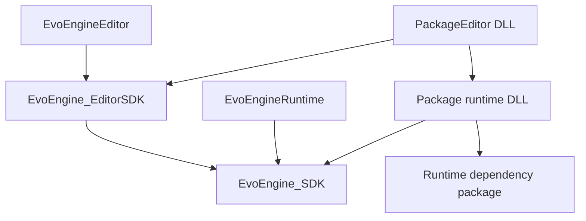

# Editor/runtime separation: dependency audit and migration design

M1 design, audited against `d7493115` on `codex/runtime-build-manager`. M2 established editor source/resource ownership. M3 established the independent editor SDK. M4 separates all eight enabled packages into runtime libraries and editor companions. Existing runtime build behavior is documented in [runtime-builds.md](runtime-builds.md).

## Current GUI ownership

Core ImGui and its platform/rendering backends now belong to `EvoEngine_SDK`. `ImGuiLayer`, `RuntimeGuiContext`, and `GuiTextureRegistry` are available to runtime hosts; editor extensions (ImGuizmo, ImNodes, dialogs, inspection, and editor panels) remain in `EvoEngine_EditorSDK`. `EditorTextureRegistry` is a compatibility alias for the shared registry. Each application has one ImGui implementation and frame owner; headless bootstrap does not create GUI layers.

The runtime boundary permits core ImGui while continuing to reject editor headers, targets, extensions, and per-class editor guards. Rebuild SDKs, applications, and packages together after this DLL ownership change. See [Runtime GUI](runtime-gui.md) for authoring, stopped/Play behavior, and layout persistence. The audit and milestone results below are historical; their no-ImGui findings predate this change.

## Agreed outcome

Maintainability is the primary goal. A developer adds a runtime component without GUI methods, empty editor overrides, or editor preprocessor guards. Custom inspection is a separately registered editor adapter. Runtime distributions exclude editor implementation, headers, libraries, and resources because of their target dependencies.

Runtime API changes and corresponding in-repository caller updates are approved. Preserve serialized type names, asset extensions, handles, field meanings, and existing saved project/asset formats. Native DLL ABI compatibility with old binaries is not promised: rebuild affected SDKs, packages, and templates together. Android deployment remains future work.

## Historical M3 implementation

`EvoEngine_SDK` owns runtime code and public runtime include paths. `EvoEngine_EditorSDK` depends on it and owns editor exports, GUI libraries, headers and its precompiled header. Editor apps, Python bindings and tests link the editor target explicitly. Both targets use the same static/shared library choice. Package-enabled builds share `glfw3` so the runtime and editor use one window-system instance; its DLL and PDB are copied and installed with the other native dependencies.

Runtime classes no longer expose SDK GUI methods or ImGui texture IDs. Editor-side registries own previews, texture descriptors and inspection state per application. Runtime integration uses layer input/window/start/render hooks, project host callbacks, auxiliary cameras and camera render passes. Package type-cleanup notifications release editor handlers before unloading package code. Native tests cover selection pixels, gizmos, preview readback, descriptor lifetime, teardown and real package unload.

All eight enabled packages now use separate editor companions; their runtime targets have no editor SDK dependency or editor PCH. M5 removes the unused legacy package helper and enforces the runtime dependency boundary. The disabled PhysX service has separate editor adapters; its missing external SDK prevents native validation and it remains disabled.

The audit below describes the original M1 checkout, not the current source inventory.

## Audit findings

The audit searched first-party C++ headers/sources for conditional directives referencing `EVOENGINE_WITH_EDITOR`, editor includes, and GUI types in headers. Counts are lexical inventory, not proof that every matching class is editor-only. They include SDK utility wrappers; no vendored source is to be rewritten.

| Area | Files with editor guards | Guard directives | Headers containing ImTextureID/ImVec2/ImVec4 |
| --- | ---: | ---: | ---: |
| SDK | 35 | 114 | 10 |
| BillboardClouds | 3 | 10 | 0 |
| EcoSysLab | 61 | 126 | 4 |
| DigitalAgriculture | 15 | 24 | 0 |
| DatasetGeneration | 3 | 9 | 0 |
| LSystem | 7 | 9 | 0 |
| Universe | 4 | 12 | 0 |
| MeshRepair | 2 | 3 | 0 |
| TextureBaking | 2 | 3 | 0 |
| PhysX service | 5 | 5 | 0 |

There are 137 guarded files and 315 directives across these areas. Five files/five directives belong to dormant PhysX code: its CMakeLists.txt currently returns immediately, so it is not built. SDK and packages account for the other 132 files/310 directives. App and Python binding source also includes editor headers, even without matching guards. A guard count alone therefore understates the boundary work.

### Build and public-header boundary

- `EvoEngine_SDK/CMakeLists.txt` recursively collects shared sources, removes a filename list and `src/Editor` for player builds, and exposes `include/Editor` through `EVOENGINE_SDK_INCLUDES`. ImGui sources and export definitions currently belong to the SDK target.
- `EvoEngine_SDK/include/EvoEngine_SDK_PCH.hpp` includes `imgui.h` unconditionally. Guarding implementation bodies does not remove this header dependency.
- `EvoEngine_Packages/include/EvoEngine_Package_PCH.hpp` unconditionally includes `EditorLayer.hpp`. Package-specific PCHs, including DigitalAgriculture, repeat this coupling.
- Packages consume broad `EVOENGINE_INCLUDES`/SDK variables rather than a runtime-only target interface. `EvoEngine_Packages/CMakeLists.txt` enables `WINDOWS_EXPORT_ALL_SYMBOLS` and uses a common export workaround in `EvoEngine_Packages/src/WindowsExportSymbols.cpp`.
- `Application.hpp` and `PackageManager.hpp` register inspectors from runtime type-registration templates. The current `InspectorRegistry::RegisterDefaultInspector` is already a no-op. Remove these obsolete calls rather than preserve an adapter requirement for every class.
- The API macro defaults `EVOENGINE_WITH_EDITOR` to 1 in `Core/EvoEngineAPI.hpp`; the final runtime API must not silently acquire editor behavior when included outside our build.

### Ownership and migration map

Paths below are relative to the repository. File groups identify migration ownership; mixed files must be split by responsibility, not moved wholesale.

| Current entry points | Runtime responsibility | Editor destination/responsibility |
| --- | --- | --- |
| SDK `include/Editor`, `src/Editor/SDKInspectionAdapters.cpp`, EditorLayer, EditorPanelManager, EditorTheme, ProjectContentBrowserPanel, InspectorRegistry, EntityBatchInspector | None of their GUI implementation | `Editor/include`, `Editor/src`; registry, panels, SDK inspector registration |
| BuildManagerPanel/Model, RuntimeExportJob | Standalone exporter remains an app/tool | SDK editor build UI, process control, and build configuration editing |
| Camera, Texture2D, TextureStorage, RenderTexture | Images, samplers, render targets, camera parameters | ImGui texture IDs, registration and retirement cache, attachment inspection |
| RenderLayer, Platform, Gizmos, EntitySelectionHighlight/Pass | Rendering, synchronization, scene data and general render APIs | Selection/highlight pipelines, editor cameras, gizmo draw passes; preserve renderer stage contracts |
| Serialization, AssetThumbnailProvider, OffscreenPreviewRenderer, Scene and asset thumbnail methods | Serialization, import/load/save handlers, runtime asset references | Preview registry and settings, thumbnail providers, preview rendering and cached icons |
| Application, Input, WindowLayer | Application lifecycle, raw input, window/swapchain/display modes | Editor bootstrap, viewport input routing, editor console UI, editor-specific presentation integration |
| Utilities, NodeGraph, Plot2D, procedural math utilities | Filesystem operations, graph data/evaluation/serialization, reusable numeric state | Dialog buttons/windows, graph canvas interaction, plots and GUI helpers |
| IAsset, IPrivateComponent, ILayer and other runtime class declarations | Lifecycle and simulation interfaces | Remove editor friends, GUI declarations and `enable_inspection` where obsolete; editor registry owns visibility/presentation |
| Package entrypoints and InspectionAdapters | Type, serialization, runtime layer and simulation registration | Companion entrypoints, inspectors, preview handlers and authoring tools |
| EcoSysLab Tree, visualizers, Physics2D, ProfileConstraints, StrandModelProfile, SpatialPlantDistributionSimulator | Growth/physics/geometry, model constraints and simulation parameters | Selected nodes, plot/canvas state, GUI rendering and visualization caches |
| PhysX Collider, Joint, PhysicsLayer, PhysicsMaterial, RigidBody | Physics behavior and data | Service editor adapters linked only into editor composition |
| EvoEngine_App and PythonBinding | Runtime host and headless interfaces | Explicitly link editor SDK for editor bootstrap/bindings that expose editor functionality |

The ten SDK GUI-bearing headers are EditorLayer, Camera, ImGuiFileDialog, imnodes, imnodes_internal, NodeGraph, Plot2D, RenderTexture, Texture2D, and TextureStorage. The four EcoSysLab headers are the simulator and three physics/profile headers listed above. Avoid moving numeric/model state merely because it uses an ImGui vector today: replace that representation with the existing runtime math types, retaining serialized values.

`Tree` visualizers are touched by initialization/reset/clear paths as well as GUI code. Move their lifetime into a per-scene/component editor store, invalidated on model revision and scene/component destruction. Do not carry GUI caches into scene cloning. Inspect existing serialization for each moved member; if a legacy saved field needs preserving, use a compatible data representation or editor metadata adapter rather than silently dropping it.

## Final folder and target layout

```text
EvoEngine_SDK/
  include/  src/  Internals/                 # runtime
  Editor/
    include/  src/  Internals/
    CMakeLists.txt
EvoEngine_Packages/<Package>/
  include/  src/  Internals/                 # runtime
  Editor/
    include/  src/  Internals/
    CMakeLists.txt
```

Use the same separation for the five PhysX GUI adapters under the service's `Editor/` directory. They are part of source-boundary cleanup, not a new service-DLL redesign or a request to reactivate PhysX. Validate source separation for this dormant service; do not claim a current PhysX binary test.

Final dependency graph (arrows mean links/depends on):



- `EvoEngine_SDK` remains the runtime target. With native packages enabled it is shared; preserve the existing static SDK configuration when packages are disabled.
- `EvoEngine_EditorSDK` is shared when companion DLLs are enabled, so all companions use one ImGui context and one set of editor registries. Do not statically duplicate registries/ImGui into each companion. A static editor composition can remain supported when native packages are disabled.
- `<Name>Package` remains the runtime DLL; `<Name>EditorPackage` is the optional companion. Runtime dependencies do not automatically imply editor-to-editor links. Add an editor dependency only when an adapter actually consumes its API; prefer dependence on runtime data instead.
- Runtime classes and serialization have the same layout and behavior in editor and player builds. `EVOENGINE_WITH_EDITOR` selects targets at CMake/application composition boundaries, not runtime class definitions.
- Use target-specific public runtime includes and private PCHs. Editor includes must never be exported by runtime targets. Split shared third-party include/library lists so removing `Editor/` alone cannot leave ImGui transitively visible.
- Introduce `EVOENGINE_EDITOR_API` for editor SDK symbols. Runtime declarations retain `EVOENGINE_API`. Audit moved declarations/forward declarations and package cross-DLL symbols; explicitly export/import required APIs and data instead of relying on accidental PCH exports. Keep the existing Windows export workaround until its removal is independently validated.

## Runtime integration contracts

Use existing layers and registries wherever possible. Add only the narrow missing contracts, with deterministic removal; do not create a generic service locator or callbacks per runtime component.

- Editor bootstrap explicitly registers SDK inspectors/previews and editor layers. `Application::Initialize` no longer references concrete editor types. Preserve the order: runtime types, SDK editor registration, package runtime/companion registration, then project content and editor use.
- Input routing must express whether a layer consumed/handled scene input without `GetLayer<EditorLayer>()`. Preserve viewport-specific scene key routing and unconditional runtime Alt+Enter behavior.
- Editor rendering owns selection/gizmo pipelines and ImGui descriptor registrations. Expose the required runtime attachment views, sampler handles, resource generation, and rendering insertion point. Preserve ordering and synchronization; do not insert editor work inside material-free geometry stages.
- Texture registrations are cached by resource identity and generation, not bare reusable handles. Rebuild after resize, and retire descriptors only after relevant GPU work completes. This replaces calls from Camera/RenderTexture to EditorLayer.
- Move asset preview callbacks out of `Serialization` into an editor preview registry, retaining its owner-based registration pattern. Serialization retains actual asset I/O and saved-format handling.
- Existing Application callback vectors have no unsubscribe handle. Any companion-owned callback must have owner-scoped removal and be drained before module unloading. Prefer existing layer lifetime for update hooks; extend removal only where needed.
- Replace BuildManager checks embedded in runtime playback/package code with a runtime operation lease/busy predicate controlled by the caller. It carries no editor types and preserves the rule that export cannot race playback or package changes.

## Companion package ABI and lifecycle

### Current behavior

`PackageManager.cpp` opens one library, validates manifest and API-v2 descriptor identity, registers types, calls load, then restores unknown types. Windows editor loading makes a per-package shadow copy; strict runtime loads shipped libraries directly. Unload rejects active playback and loaded dependents, checks component owners, removes package layers, clears pools, checks live object counts, calls unload, unregisters serialization/inspectors/profiler state, then closes the library. Reload is unload followed by load.

Those checks must remain. Adding a second `LoadLibrary` call is insufficient: registries store `std::function` values whose destructors and callbacks may execute code in the companion, and preview jobs/GPU work can outlive a panel.

### Intended interface and ownership

Keep `PackageManager` runtime-only. An editor-owned coordinator participates through an optional, runtime-neutral package lifecycle interface installed before initial package loading. It receives package metadata and lifecycle stages, never EditorLayer/ImGui types. Invoke external lifecycle functions outside the manager mutex; prohibit reentrant mutation of the same transaction. Disconnect the coordinator before destroying editor registries, after unloading companions.

Companions expose versioned descriptor/load/unload entrypoints, with a proposed `EditorPackageDescriptor` and `EditorPackageRegistrar` defined in the editor SDK. Descriptor validation includes runtime package name/source identity, editor SDK identity, compiler/configuration/platform/architecture, and a separate editor ABI version. Registrar APIs install owner-scoped inspectors, previews, panels and hooks only; they cannot register duplicate runtime types.

Add an explicit companion manifest (for example `<Name>.eveeditorpackage`) containing its library hash, runtime dependency identity, and editor dependencies. Runtime manifests stay sufficient to load runtime packages alone. Bump native runtime package API/manifest compatibility as needed for the runtime ABI change; this is not a project or asset schema migration.

The editor treats an absent companion declaration as a supported runtime-only package. A declared but missing/incompatible companion makes the editor activation fail with a useful error; do not silently present a partially configured package as fully loaded.

### Load, unload, and failure sequencing

1. Load runtime dependencies in existing dependency order. Validate the runtime descriptor and register runtime types/layers.
2. In the editor, validate and load its companion and required editor dependencies against the already loaded runtime modules. Record all editor registrations under a distinct owner such as `Package/Editor`.
3. Complete registration before restoring unknown types or exposing the package as ready to editor code. Runtime-only loading has no companion step.
4. On failure, remove newly installed editor handlers/jobs/state before closing the companion. Roll back runtime registration/load work introduced by the transaction in reverse order, including layers and pools. Do not unload dependencies that were already loaded or are still used elsewhere. Keep modules mapped if live code/resources cannot be safely released; report the failed state explicitly.
5. Before unload, reject loaded dependents, active operations and externally held runtime objects as today. Stop new companion work, cancel/join preview jobs, drain owner callbacks, remove editor panels/state and release references. Keep the companion mapped through this preparation. Recheck runtime live-object constraints; a failed unload must leave valid registered functionality or explicitly restore its editor activation.
6. Once safe, destroy companion registry entries, captured functions, UI/GPU resources and companion objects while its DLL is mapped. Run its unload callback as part of this teardown, close the companion, then unregister/unload the runtime package. Do not close any module with outstanding callbacks, GPU work, or live objects.
7. Reload the pair through the same validated sequence. Test partial companion load failures, rejected unloads, and shutdown ordering, not only successful reload.

On Windows, stage each runtime/companion pair as one coherent shadow generation and validate its hashes before loading. Load runtime modules/dependencies first with deliberate search paths. Verify the companion binds to those exact loaded modules rather than pulling a second copy from its original directory. Do not hot-swap a runtime package beneath loaded dependents. This is a required M4 native loader test, not an assumption about implicit DLL search behavior.

## Identity, resources, and distribution

The M1 identity generator hashed whole SDK/package roots. M4 separates runtime and editor identities through `cmake/EvoEngineNativeBuild.cmake`, `Scripts/write_build_identity.py`, package manifests, installer and template validation together:

- Runtime source identities exclude editor code/resources; editor identities include the runtime identity plus editor sources/dependencies. Editor-only edits should not invalidate runtime package binaries.
- Runtime SDK/package identities no longer vary merely because the consuming application has an editor. Preserve compiler/configuration/platform checks and separate editor ABI checks. Both build trees can remain for validation; removing the separate template workflow is outside this migration.
- Move editor icons, UI assets, gizmo/highlight shaders and preview-only resources under editor-owned resource roots. Shared assets/shaders used by runtime rendering remain runtime resources even if an editor preview also uses them.
- Replace growing exclusion patterns with explicit runtime/editor resource ownership. Installed editor apps receive both resource sets; payload construction receives only runtime targets/resources.
- `Scripts/install_apps.py`, package build tooling, `prepare_runtime_template.py`, native exporter and native identity tests must understand companions. Export only selected runtime packages and dependencies; never discover companions through an indiscriminate DLL-directory copy.
- Preserve executable-relative Logs/Cache/UserData, PDB behavior, startup scene/window configuration, all loose project assets, and the stock application icon.

## Migration sequence and buildable milestones

M2 and M3 overlap at the link boundary: moving EditorLayer into a new shared library while SDK code still calls it would create a forbidden reverse dependency. Use the following explicit staging instead of introducing a permanent cycle.

1. **M2: folders and source ownership.** Establish editor CMake source/object targets and relocate isolated editor files/resources. During this milestone only, the existing editor-enabled SDK may aggregate the editor objects, preserving the current working linker arrangement. Player builds omit them. Mark this aggregate as transitional; it does not claim final binary separation. Set up runtime/editor target interfaces and split PCH ownership where currently possible. Do not remove required include paths until their users move.
2. **M3: SDK dependency cut.** Move mixed SDK GUI functions, editor members, preview registry and integration calls. Move the PhysX adapters needed to complete SDK/service closure. Then replace the temporary aggregate with `EvoEngine_EditorSDK`, remove GUI headers from the runtime SDK/PCH and remove the reverse dependencies. No transitional bridge/object aggregation remains in the SDK at M3 completion. Update app, test and Python consumers in the same milestone. Until M4, editor-enabled legacy package targets may explicitly link the new editor SDK for their remaining GUI functions; player package variants must still exclude those functions. This temporary package-level coupling ends when each companion is extracted.
3. **M4: package companions.** Pilot the complete pair load/unload contract with TextureBaking (small existing adapter). Migrate independent MeshRepair, LSystem and Universe, then BillboardClouds -> EcoSysLab -> DigitalAgriculture -> DatasetGeneration. Actual runtime dependency declarations are EcoSysLab -> BillboardClouds, DigitalAgriculture -> EcoSysLab, and DatasetGeneration -> both EcoSysLab and DigitalAgriculture. Preserve supported-platform restrictions for TextureBaking/MeshRepair. Update package PCHs, identity/manifests and build/install/export tooling with the migration.
4. **M5: enforce and document.** Remove remaining migration exceptions/stubs, obsolete registration calls, source-exclusion lists and default editor macros in runtime headers. Publish the component/inspector/package authoring workflow. Enforce the complete boundary in CI.
5. **M6: integration acceptance.** Validate all prior demos, serialization fixtures, editor operations, pair lifecycle, installed payloads and relocation. Install all applications and record limitations honestly.

Commit each milestone after focused validation and formatting. M1 introduces documentation only; it does not authorize jumping directly into the implementation milestones in this task.

## Acceptance checks

| Check | Required evidence |
| --- | --- |
| Header boundary | Compile runtime SDK/package public headers using only their declared target interfaces, with editor/UI include directories absent. Include representative downstream headers with PCH disabled to expose hidden dependencies. |
| Dependency boundary | Inspect resolved CMake target link/include graphs, including transitive interface libraries and configuration-specific generator expressions. Reject editor-classified targets/paths in runtime closure. Add negative fixtures that deliberately include an editor header or link an editor library and must fail. |
| Source boundary | Supplement compiler checks with a first-party policy scan for editor includes/GUI types or new per-class editor guards in runtime roots, including guarded code that a player-only compile could otherwise hide. Track only temporary, explicit exceptions during migration; none at final acceptance without a justified composition boundary. |
| Binary/resource boundary | Inspect actual runtime DLL imports and packaged file inventory for editor DLLs, ImGui implementation and editor resources. Test both build configurations supported by CI; do not rely on dead stripping or filename scans alone. |
| Extension workflow | A new minimal runtime component builds without GUI declarations; an optional companion inspector registers/unregisters without changing that component. |
| Editor behavior | Existing inspector/batch-inspector tests, selection/gizmos, graph editors, texture preview resize/recreation, scene switching, Build Manager and native folder picker. Build the relevant executable before manual checks and record its exact path. |
| Package lifetime | Native fixture pair checks symbol binding to the correct runtime instance, exact identity rejection, loaded dependents, outstanding runtime references, cancellation, callback destruction, failed load rollback, unload retry, reload, and shutdown. |
| Serialization | Existing scene/asset fixtures load and round-trip with unchanged handles/type names/field meanings; graph/math types retain numeric data; strict runtime never repairs source assets. |
| Runtime parity | Current runtime boundary suite, four display modes/Alt+Enter, camera sizing, console/logging, native exporter tests and real export/Unicode relocation. |
| Demo coverage | All current demo profiles through the existing author/export/relocate harness; retain documented starter-scene limits rather than claiming untested generated content. |
| Identity | Editing editor-only code changes editor identity only; runtime changes invalidate runtime and relevant companions; mismatched companion/runtime pairs fail before registration. |

Existing tests in InspectorRegistryTest, EntityBatchInspectorTest, SerializationRegistryTest, StrictRuntimeLoadingTest, RuntimeBoundaryTest and Scripts/tests cover useful portions. They do not currently establish the companion-DLL contract. Add the native fixture pair rather than trying to infer unload safety solely from live-object counters.

## M1 conclusion

No further product decision is required. The approved design is feasible with the staged M2/M3 link transition above. The largest implementation areas are EcoSysLab's mixed model/visualization types and companion lifetime management. These require focused implementation and tests; M1 has not validated a future DLL loader or a separated build.

## M1 validation record

Documentation-only change. Verified the inventory and major source anchors against the checkout. Ran 51 focused existing tests covering inspector/batch-inspector registries, selected serialization contracts, Build Manager/project state, runtime configuration/paths, native identity, strict loading, and window policy: all passed (`out/editor-separation-m1-tests.log`). This is a baseline, not validation of the proposed split. No full-suite or manual UI run was performed for M1.

All applications and the matching runtime template installed successfully, exit 0 (`out/editor-separation-m1-install.log`), using:

```powershell
python Scripts/install_apps.py --config RelWithDebInfo --incremental --no-clean-install --no-open --jobs 8 --cmake-arg=-DBUILD_TESTING=OFF --cmake-arg=-DEVOENGINE_WITH_EDITOR=ON --cmake-arg=-DEVOENGINE_ENABLE_GRAPHICS_VALIDATION=OFF
```

Installed editor: `C:/Users/lllll/Documents/GitHub/EvoEngine/out/install/vs2026-x64/bin/EvoEngineEditor.exe`.

## M2 validation record

The editor object target and runtime/editor source trees build successfully. The generated player project has neither editor compilation units nor an editor object target. All 185 selected editor tests (including the production SDK shader compilation inventory), 18 runtime CTest entries, and 30 Python/exporter tests passed. Real export and Unicode relocation passed using the installed runtime template; the tested executable was `out/editor-separation-m2-host/relocated runtime Ω/distribution/EvoEngineRuntime.exe`.

All 296 SDK resource files preserve their Git content and installed relative paths. The combined 222-entry shader inventory matches the pre-move inventory exactly. The checked-in SDK shader policy is already stale against that baseline; this milestone preserves coverage of both resource roots without rewriting unrelated policy expectations. Initial test failures were old shader-source paths and passed after updating those paths.

All-app installation used the M1 command above and exited 0 (`out/editor-separation-m2-install.log`). Template `986c4d02ea27d35cc0496dac58aa9d7de79bdc8b8436249b948f8f85072136fa` excludes the relocated editor resources; the installed editor includes them. Full SDK/PCH isolation and the independent editor DLL remain M3 work. No manual editor UI checks or complete repository test suite were run in M2.

## M3 validation record

The independent runtime and editor SDKs, all enabled editor/player packages, editor applications and Python bindings build successfully. Generated SDK projects have no editor/ImGui include paths in either configuration. DLL inspection confirms the editor SDK imports the runtime SDK, the runtime SDK does not import the editor SDK, and both share `glfw3.dll`. Runtime SDK exports contain no ImGui, ImGuizmo, EditorLayer or InspectorRegistry symbols.

Passed 312 focused editor/native tests, 21 runtime tests and all 30 Python/exporter/resource tests. Native editor tests exercise ImGui startup/shutdown, selected-cube outline and gizmo pixels, preview readback, texture descriptor reuse/retirement, application isolation, project extension metadata, batch inspection, viewport input and real BillboardClouds handler cleanup on unload. Logs are `out/editor-separation-m3-final-{editor,runtime,python}-tests.*`.

The full repository suite was not run. The unchanged `SerializationRegistry.FirstPartyPostProcessingAssetsEnableSsrProductionDefaults` fixture test is excluded: the committed DigitalAgriculture default scene lacks the explicit SSR YAML fields that this raw-YAML test expects. The disabled PhysX service received source separation only; its external SDK headers are absent, so it was not compiled or enabled. Manual editor UI and complete demo coverage remain M6 work.

All applications installed successfully using the M1 install command above (exit 0, `out/editor-separation-m3-install-final.log`). The installed editor is `C:/Users/lllll/Documents/GitHub/EvoEngine/out/install/vs2026-x64/bin/EvoEngineEditor.exe`; its adjacent Editor SDK DLL/PDB and shared GLFW DLL/PDB are present. Runtime template `74f539e184bb16f1e7fbddc1d524823bf6a1d46c2cc69030b98b5c3920b303f8` includes host/SDK/GLFW and package PDBs, has 448 verified file hashes, and contains no Editor SDK or editor resource paths.

Real native export, Unicode relocation, output-relative writable directories and strict-runtime failure checks passed with the installed exporter/template (`out/editor-separation-m3-native-host.log`). The actual launched runtime executable was `C:/Users/lllll/Documents/GitHub/EvoEngine/out/editor-separation-m3-host/relocated runtime Ω/distribution/Runtime Smoke 应用.exe`. This is a small runtime integration fixture, not a claim of all-demo acceptance.

## M4 implementation and validation

TextureBaking, MeshRepair, LSystem, Universe, BillboardClouds, EcoSysLab, DigitalAgriculture and DatasetGeneration each have `Editor/include`, `Editor/src` and an editor CMake target. Inspectors, thumbnails, graph controls, viewport tools and transient GUI state live in those targets. EcoSysLab and DigitalAgriculture icons moved into their editor resource roots. Runtime data, simulation and serialization remain in the runtime libraries. Tree visualization follows explicit model revisions; its cache holds weak component ownership and resets on scene/model changes.

Runtime package API 3 and editor companion API 2 coordinate registration, readiness, shadow loading and teardown. Companions validate their DLL hash, native identity, runtime module token and separate editor identities before registering callbacks. Registrar-owned callbacks keep the module mapped until their captured code is destroyed. Active callbacks and externally held layers refuse unload; failed activation drains pending assets and records an unready package when retained runtime objects prevent rollback. Editor dependencies are explicit and must also be declared runtime dependencies; EcoSysLab uses the BillboardClouds editor helpers.

Runtime fingerprints exclude first-party `Editor` roots and match across editor/player build trees. Editor SDK and companion fingerprints include their runtime inputs and explicit editor dependencies. `with_editor` remains build-composition metadata, while the player manifest still requires a runtime build. Third-party dependency hashing remains conservative: changing an editor-only vendored dependency can still invalidate runtime provenance.

The editor SDK, all eight runtime/companion pairs, and the native test executables build in Windows x64 RelWithDebInfo. Passed 100 focused native tests covering package lifecycle, compatibility, serialization, inspector ownership, viewport cleanup and asset draining, plus 15 EcoSysLab numerical/model-revision tests. Passed 22 Python identity/resource/export/install/template tests (native exporter fixture not configured in that run). The focused native logs are `out/editor-separation-m4-identity-tests.log` and `out/editor-separation-m4-identity-numeric-tests.log`. The pre-existing DigitalAgriculture SSR YAML fixture exclusion from M3 remains.

Both build-tree runtime SDK and all eight package source identities match; runtime metadata contains no editor identity entries. The runtime-only host and all eight packages also build successfully. Import inspection of the runtime SDK and all eight package DLLs finds no editor SDK, companion or ImGui dependencies (`out/editor-separation-m4-runtime-imports.log`). Full installed-app, demo, GUI and relocated-export acceptance remains M6 work; these focused checks do not establish that coverage.

## M5 implementation and validation

The legacy package editor PCH, companion opt-in flag, default public editor macro and resource-name exclusion lists are removed. The editor helper now declares its manifest on the runtime target when the companion is actually composed. Runtime resources and editor resources copy from separately owned roots. [The extension workflow](editor-extension-workflow.md) documents component, inspector, companion, state and resource ownership.

`EvoEngineRuntimeBoundary` is a required dependency of runtime SDK/service/package targets and the player host. Its configuration-resolved CMake graph includes interface links/sources, aliases, imported references, include directories and PCHs. The source pass follows literal first-party includes, rejects macro includes that hide dependencies, GUI types and per-class editor guards. Negative fixtures run in CI; native build jobs execute the live graph check even when tests are disabled. Runtime public headers retain no default editor macro.

Both editor and player RelWithDebInfo builds pass, including PCH-disabled compilation of representative SDK and LSystem public headers. All 334 selected editor/native tests, 15 EcoSysLab numerical tests, 21 player tests and 41 Python/native-exporter tests pass. The broader native selection caught one stale EcoSysLab source-location assertion; it now verifies editor viewport readiness feeding the runtime growth flag. The pre-existing SSR YAML fixture exclusion and disabled PhysX service remain as documented in M3.

Generated Debug and RelWithDebInfo dependency graphs pass for both compositions. This validates configuration-dependent graph resolution; it does not claim a native Debug compilation. Logs are `out/editor-separation-m5-{native-tests,numeric-tests,runtime-tests,python-exporter-tests}.log`, with native build and boundary logs alongside them. Full installed-app and demo acceptance follows in M6.

## M6 validation record

Integration testing exposed two EcoSysLab crashes. Editor flow visualization allocated organ buffers from simulation counters that are not restored with saved skeletons; it now counts the actual active organs and uses one prefix entry per tree. AddressSanitizer then identified a double-free during parallel tree growth: reads of a shared, resolved `AssetRef` unnecessarily reassigned its cached type-name string. Resolved reads no longer mutate that cache. Handle/type queries and serialization continue to read the referenced asset directly. Resolution and reference changes still require exclusive access. A synchronized eight-reader regression covers resolved access and serialized metadata.

The final RelWithDebInfo builds passed 335 selected editor/native tests, 15 EcoSysLab numerical/revision tests, 21 player tests, and all 41 Python/native-exporter tests. Both compositions compiled the representative runtime headers without PCH. Resolved Debug and RelWithDebInfo dependency graphs passed for both compositions; native Debug compilation was not performed. Final logs use the `out/editor-separation-m6-final-` prefix.

The installed template is `d96c70e00ee624ea82b573cf7a58ed26d853fc999a1b6391b75b9538dd1c92ee`. The audit verified all 448 file hashes, matching editor/player runtime identities, the SDK and eight runtime DLL import tables, and all eight installed editor companions and PDBs. The player payload excludes editor DLLs/resources. Temporary AddressSanitizer binaries were rebuilt normally; installed application/package imports contain no AddressSanitizer runtime.

All ten demo profiles passed authoring, export, Unicode relocation, and 60-frame runtime checks against a fresh isolated resource copy: EcoSysLab, Rendering, Rendering Regression, DDGI, DigitalAgriculture, LSystem, Procedural Galaxy, 3DGS, Bicycle, and Bistro. EcoSysLab completed its eight-year Acacia growth animation and mesh generation before export. The harness verified camera metadata, package activation, unchanged packaged assets/project metadata, and output-relative writes from an unrelated working directory. Results and all ten reviewed captures are under `out/editor-separation-m6-final/matrix`. DigitalAgriculture and LSystem retain their documented starter-scene limits. The stochastic Rendering/Bistro captures are functional smoke evidence, not image-quality or performance benchmarks.

The standalone native exporter/runtime-host integration also passed (`out/editor-separation-m6-final-host.log`), including source preservation, strict failure cases, and portable Unicode output. The launched executable was `C:/Users/lllll/Documents/GitHub/EvoEngine/out/editor-separation-m6-final-host/relocated runtime Ω/distribution/Runtime Smoke 应用.exe`.

All applications and the matching runtime template installed successfully (exit 0, `out/editor-separation-m6-install-final.log`) using:

```powershell
python Scripts/install_apps.py --config RelWithDebInfo --incremental --no-clean-install --no-open --jobs 8 --cmake-arg=-DBUILD_TESTING=OFF --cmake-arg=-DEVOENGINE_WITH_EDITOR=ON --cmake-arg=-DEVOENGINE_ENABLE_GRAPHICS_VALIDATION=OFF
```

The authoring harness launched `C:/Users/lllll/Documents/GitHub/EvoEngine/out/install/vs2026-x64/bin/EvoEngineEditor.exe`. The launcher and runtime exporter are installed alongside it, with the Python runtime under `out/install/vs2026-x64/python`.

Validation limits: manual Build Manager/folder-picker and interactive editor checks could not run because the Windows computer-control helper failed to launch with OS error 123, including after retry and reset. Native inspector, selection/gizmo, graph, preview, scene/project, and companion lifecycle tests passed, but they do not replace that manual coverage. PhysX remains disabled because its external SDK is unavailable. The existing `SerializationRegistry.FirstPartyPostProcessingAssetsEnableSsrProductionDefaults` raw-YAML fixture exclusion remains as documented in M3; a full repository test run is not claimed. The installation and demo runs use graphics validation disabled.
