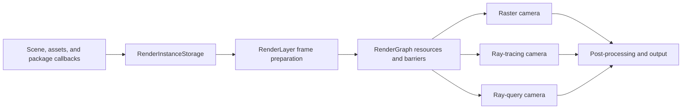

# EvoEngine Rendering

[Back to README](../README.md)

EvoEngine uses a Vulkan renderer built around `RenderLayer`. This page explains how scene data becomes a rendered camera
image and where each rendering responsibility lives.

Focused guides:

- [Materials and geometry](rendering-materials.md)
- [Texture access](rendering-texture-access.md)
- [Dynamic Diffuse Global Illumination](ddgi.md)
- [Reflection probes](reflection-probes.md)
- [Rendering demos](rendering-demos.md)
- [Rendering validation](rendering-validation.md)
- [Rasterization culling results](rasterization-culling-results.md)

## Architecture

### Image layouts and synchronization

First-party sampled, storage, attachment and transfer images use `VK_IMAGE_LAYOUT_GENERAL` during GPU access,
including textures/cubemaps, camera targets, shadows, GI, post-processing, previews and Universe picking.
Descriptors and rendering attachments declare the same layout. Image creation still uses `UNDEFINED` followed
by an initialization transition; swapchain images still transition to `PRESENT_SRC_KHR` for presentation.
The generic low-level transition helper retains support for other legal layouts for external callers.

Render-graph states continue to describe access intent (depth/color writes, shader reads/writes and transfers).
Equal-layout image barriers are retained with the corresponding stage/access masks and queue ownership rules;
`GENERAL` is not a replacement for memory synchronization. Depth barrier aspects derive from the image format,
including when neither adjacent access is an attachment use. This policy does not require unified-image-layout
extensions and makes no cross-device performance guarantee.

DDGI atlases are initialized and cleared synchronously on allocation before descriptor publication, since the
deferred prepare pass may not yet be submitted when a consumer sees them. This allocation-only cost does not
change steady-state update scheduling or history policy.

The motivating validation errors involved camera depth (sampled-read descriptor versus attachment layout),
SSR motion vectors (GENERAL descriptor versus an explicit read-only transition), and newly published DDGI
atlases still in UNDEFINED. These are image-state/lifetime issues, not atlas-size or VMA allocation limits.

Validation: 248 focused tests passed. Installed 2560x1440 Sponza runs with editor layers passed Vulkan core/sync
validation with DDGI enabled (600 iterations) and SDFGI with RT disabled (300 iterations plus capture frames).
This is focused coverage, not full-suite or cross-device/performance acceptance.

### Rendering flow

| Owner | Responsibility |
| --- | --- |
| `Camera` | View state, output texture, visible background, requested render technique, ray settings, and post-processing stack. |
| `Scene` | Renderable entities, lights, the main camera, environmental-lighting reference, and global reflection-probe fallback. |
| `EnvironmentalLighting` | Indirect GI provider, environment source, DDGI/SDFGI settings, local reflection probes, and fallback intensities. |
| `RenderInstanceStorage` | Immutable per-frame GPU view of geometry, materials, transforms, lights, cameras, environment data, descriptors, and acceleration-structure inputs. |
| `RenderGraph` | Logical resources, pass ordering, access declarations, transient allocation, and Vulkan barrier planning. |
| `RenderLayer` | Pipeline creation, frame preparation, shadows, camera rendering, probe work, extension callbacks, diagnostics, and output handoff. |

The renderer produces an immutable render-instance snapshot during frame preparation. Camera passes consume that
snapshot rather than reading mutable scene components while commands are being recorded. Unchanged rigid renderers under
a static scene root may reuse cached render-instance records while the frame-local snapshot, visibility, LOD selection,
and draw lists are still rebuilt for the current cameras.

## Shader Source Policy

All first-party shaders use native Slang source in `.slang` or `.slangh` files. Use Slang modules and `import` for shared
code; legacy shader extensions, GLSL compatibility syntax, and textual `#include` directives are rejected before the
Slang frontend runs. `Extern/` is third-party scope and is exempt from this source policy.

## Frame Flow

1. The application updates the project, scene, transforms, and layers.
2. `RenderLayer::PrepareForRendering` gathers render instances and resolves lighting state.
3. Geometry and textures complete pending uploads; acceleration structures and per-frame descriptors are prepared.
4. Shared work such as shadows, DDGI updates, and reflection-probe captures is recorded.
5. Each camera executes its raster, ray-tracing, or ray-query graph.
6. Post-processing writes the final camera image for the editor, application window, render texture, or capture path.

Frame-slot fences protect resources still used by submitted GPU work. Transient graph resources and replaced renderer
objects remain alive until their owning slot is recycled.

## Static Scene Contract

`Scene::SetEntityStatic(entity, true)` marks the entity's root hierarchy static. Static status is a performance contract:
unchanged rigid `MeshRenderer` records can be reused across frames. Skinned meshes, particles, strands, Gaussian splats,
external renderers, and API draws remain dynamic, and camera-dependent LOD and visibility are always evaluated per frame.

Scene structural APIs invalidate the cache automatically. Editor transform, gizmo, component, and private-component
edits also notify the renderer when they affect a static hierarchy. Runtime code that directly overrides a static
transform or renderer field must call `RenderLayer::NotifyStaticEntityChanged(scene, entity)` after the mutation. The
notification invalidates the affected subtree and reconciles its transforms before the next render snapshot; omitting it
can leave cached raster and ray inputs stale.

TLAS logical inputs are collected alongside canonical render-instance blocks instead of retraversing every renderer
collection. Each frame slot retains its acceleration-structure resources. If instance descriptors, transforms, BLAS
addresses, and BLAS content versions are unchanged, TLAS preparation is an exact reuse with no Vulkan build or update.

## Camera Techniques

| Technique | Rendering path | Availability behavior |
| --- | --- | --- |
| Rasterization | Raw opaque/masked GBuffer, fused compute material evaluation and lighting, forward/transparent rendering, then post-processing. | Always available. |
| Ray tracing | Vulkan ray-tracing pipeline running the shared path-tracing integrator. | Falls back to ray query when available, otherwise rasterization. |
| Ray query | Compute pipeline using inline ray queries with the shared path-tracing integrator. | Falls back to ray tracing when available, otherwise rasterization. |

The resolved technique is reported when it differs from the camera request. Ray tracing and ray query share material
evaluation, BSDF logic, environment and emissive sampling, path controls, debug views, and optional outputs. Only their
traversal adapters differ.

Ray-camera accumulation belongs to each camera. Resizing, technique changes, relevant camera settings, and scene changes
invalidate the affected history. An unchanged camera continues accumulating samples across frames.

## Raster Path

Opaque meshes write only raw geometry attributes and stable IDs into the GBuffer. A separate alpha-masked geometry path
samples only base-color alpha to determine coverage, then writes the same raw layout. GTAO reads the geometric normal
before an in-place compute pass evaluates full materials, publishes the resolved G-buffer surface, and writes scene
color by combining punctual lights, shadows, diffuse indirect lighting, reflection probes, and ambient occlusion.
Forward-only and blended geometry is rendered afterward, followed by optional Gaussian splats, gizmos, and
post-processing.

Persistent sampled assets and transient pass resources follow different descriptor policies. Standard material,
environment, and reflection-probe assets share bindless 2D and cubemap index spaces across raster and ray paths;
attachments, histories, and other pass-owned images retain explicit descriptors. See
[Texture access](rendering-texture-access.md) for the ownership rules and [Materials and geometry](rendering-materials.md)
for material behavior and geometry participation.

## Lighting

Direct lighting comes from directional, point, and spot lights. Environment and probe inputs are resolved from the scene
and its `EnvironmentalLighting` asset before rendering.

The asset explicitly selects Environment, Authored DDGI (RT), or the opt-in Automatic SDFGI provider. Automatic SDFGI
currently has a settings/ownership shell only and uses Environment fallback without allocating a field. See
[Automatic SDFGI](sdfgi.md) for controls and current implementation status. Inactive DDGI settings and volume packs remain
authored data but do not drive updates or lighting.

Ray cameras and DDGI sample emissive meshes through a two-level distribution. The first alias table selects a physical
render instance; the second selects an eligible triangle from a distribution shared by instances with the same geometry
range and emissive material. Rigid and uniformly scaled copies therefore store the mesh triangles once instead of
expanding every instance into a flat triangle table. Power sampling combines the instance and triangle probabilities and
divides by the current world-space triangle area. Uniform sampling remains uniform over the logically expanded eligible
triangle set by weighting its instance table by each distribution's triangle count.

Translation and rotation reuse both sampling tables, while uniform scale updates only instance-level power. Non-uniform
and deforming emitters retain exact per-instance triangle distributions. The DDGI inspector reports physical instances,
shared and fallback distributions, logical and stored triangle counts, and distribution build/upload timings; a large
fallback count identifies scenes with limited compression. Full emitter transforms remain part of DDGI invalidation even
when the sampling distribution itself is reusable.

| Use | Source and control |
| --- | --- |
| Visible primary background | The camera background source multiplied by `background_intensity`. |
| Raster diffuse indirect | Valid irradiance from the selected provider; otherwise the indirect environment source multiplied by `diffuse_fallback_intensity`. |
| Raster specular indirect | Local reflection probes, then the scene or engine global reflection probe multiplied by `specular_fallback_intensity`. |
| Ray-camera environment events | The indirect environment source multiplied by `environment_lighting_intensity`. |
| Reflection-probe capture background | The authored bake background, with inherited environment radiance multiplied by `environment_lighting_intensity`. |

All three environmental-lighting intensities default to `1.0`. Visible camera backgrounds are independent from indirect
lighting. Ray cameras do not use raster diffuse or specular fallback intensities, and they do not use the scene-global
prefiltered reflection probe as their environment radiance source.

DDGI provides diffuse irradiance only. Local and global reflection probes provide raster specular image-based lighting.
Valid DDGI visibility may reduce rough probe leakage, but DDGI irradiance does not replace a valid local probe.

## Shadows And Post-Processing

Directional lights use four cascades with Stable Sphere fitting by default; Tight Light-Space AABB fitting is available
for comparison. Directional shadows use Vogel-disc percentage-closer filtering. Point and spot lights use their own
shadow atlases and filtering paths. The quality override changes directional, point, and spot shadow-map resolution
together. Every shadow type separates opaque and alpha-masked rigid, meshlet, instanced, skinned, and strand casters.
Opaque depth shaders perform no material or texture access; masked depth shaders evaluate only base-color alpha
coverage. External shadow renderers register explicitly for one of those two contracts.

Raster cameras can use GTAO ambient occlusion, screen-space reflections, SMAA, bloom, tone mapping, and related post
effects from their `PostProcessingStack`. Ray cameras apply bloom and tone mapping after path tracing. Post-processing
resources and temporal histories are camera-owned. Assets must use the current flat GTAO and SMAA schemas.

Bloom exposes **Compression start** (default 2) and **Source ceiling** (default 8) in linear HDR bloom-source units.
After threshold/soft-knee extraction, each sampled contribution is limited before the initial downsample accumulation.
Below the start, brightness is unchanged; above it, a bounded rational curve smoothly approaches the ceiling.
The maximum RGB channel determines brightness, and RGB is scaled uniformly to preserve color ratios.
The scene's original HDR color/emission is untouched. This replaces the old per-channel hard clamp at 20.
Setting the start equal to the ceiling gives a hard cap; a zero ceiling suppresses bloom. Final bloom intensity and
threshold/knee remain independent controls. Mip contributions still add during upsampling, so this limits the bloom
source, not the final composited halo. The settings serialize with the stack; older assets use the new defaults.

## Geometry And Optional Features

Regular, skinned, instanced, transparent, strand, Gaussian-splat, and externally registered geometry enter the renderer
through separate render-instance collections. Participation depends on the selected pass and the data supplied by the
renderer owner.

Strands use the mesh-shader raster path when supported. Ray cameras also include strands when the Vulkan device exposes
`VK_NV_ray_tracing_linear_swept_spheres` with `linearSweptSpheres`. Without that capability, strands are omitted from ray
tracing and ray query while raster strand rendering remains available. DDGI does not traverse strand geometry.

## Extending Rendering

Packages and services extend rendering through explicit APIs rather than by modifying built-in pass internals:

- register logical resources and frame- or camera-level render-graph passes;
- register external render instances and, when applicable, compatible acceleration-structure metadata;
- use raw opaque or alpha-only masked deferred callbacks, forward/transparent callbacks, explicit opaque or alpha-only
  masked shadow callbacks, and gizmo callbacks exposed by `RenderLayer`;
- provide package-owned shaders, descriptors, and resources for package-specific rendering.

External geometry participates only in the paths for which it supplies the required draw or traversal contract. For
example, DDGI requires compatible triangle acceleration-structure and offset data.

## Source Entry Points

Start with `RenderLayer`, `Camera`, `RenderGraph`, and `RenderInstanceStorage` in `EvoEngine_SDK`. Material and lighting
shader modules live under `EvoEngine_SDK/Internals/DefaultResources/Shaders/Modules/EvoEngine`.
