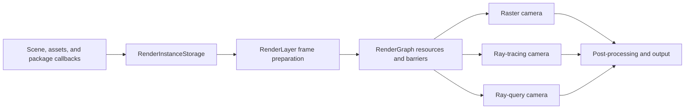

# EvoEngine Rendering

[Back to README](../README.md)

EvoEngine uses a Vulkan renderer built around `RenderLayer`. This page explains how scene data becomes a rendered camera
image and where each rendering responsibility lives.

Focused guides:

- [Materials and geometry](rendering-materials.md)
- [Dynamic Diffuse Global Illumination](ddgi.md)
- [Reflection probes](reflection-probes.md)
- [Rendering demos](rendering-demos.md)
- [Rendering validation](rendering-validation.md)

## Architecture

| Owner | Responsibility |
| --- | --- |
| `Camera` | View state, output texture, visible background, requested render technique, ray settings, and post-processing stack. |
| `Scene` | Renderable entities, lights, the main camera, environmental-lighting reference, and global reflection-probe fallback. |
| `EnvironmentalLighting` | Indirect environment source, DDGI settings and volumes, local reflection probes, and their fallback intensities. |
| `RenderInstanceStorage` | Immutable per-frame GPU view of geometry, materials, transforms, lights, cameras, environment data, descriptors, and acceleration-structure inputs. |
| `RenderGraph` | Logical resources, pass ordering, access declarations, transient allocation, and Vulkan barrier planning. |
| `RenderLayer` | Pipeline creation, frame preparation, shadows, camera rendering, probe work, extension callbacks, diagnostics, and output handoff. |

The renderer builds a fresh render-instance snapshot during frame preparation. Camera passes consume that snapshot rather
than reading mutable scene components while commands are being recorded.

## Frame Flow

1. The application updates the project, scene, transforms, and layers.
2. `RenderLayer::PrepareForRendering` gathers render instances and resolves lighting state.
3. Geometry and textures complete pending uploads; acceleration structures and per-frame descriptors are prepared.
4. Shared work such as shadows, DDGI updates, and reflection-probe captures is recorded.
5. Each camera executes its raster, ray-tracing, or ray-query graph.
6. Post-processing writes the final camera image for the editor, application window, render texture, or capture path.

Frame-slot fences protect resources still used by submitted GPU work. Transient graph resources and replaced renderer
objects remain alive until their owning slot is recycled.

## Camera Techniques

| Technique | Rendering path | Availability behavior |
| --- | --- | --- |
| Rasterization | Opaque GBuffer, deferred lighting, forward/transparent rendering, then post-processing. | Always available. |
| Ray tracing | Vulkan ray-tracing pipeline running the shared path-tracing integrator. | Falls back to ray query when available, otherwise rasterization. |
| Ray query | Compute pipeline using inline ray queries with the shared path-tracing integrator. | Falls back to ray tracing when available, otherwise rasterization. |

The resolved technique is reported when it differs from the camera request. Ray tracing and ray query share material
evaluation, BSDF logic, environment and emissive sampling, path controls, debug views, and optional outputs. Only their
traversal adapters differ.

Ray-camera accumulation belongs to each camera. Resizing, technique changes, relevant camera settings, and scene changes
invalidate the affected history. An unchanged camera continues accumulating samples across frames.

## Raster Path

Opaque and alpha-masked meshes normally write evaluated material attributes into the GBuffer. Deferred lighting combines
punctual lights, shadows, diffuse indirect lighting, reflection probes, and ambient occlusion. Forward-only and blended
geometry is rendered afterward, followed by optional Gaussian splats, gizmos, and post-processing.

Raster material textures use fixed descriptors so ordinary raster rendering does not require bindless descriptor-array
features. Ray cameras retain bindless texture access for material evaluation during traversal. See
[Materials and geometry](rendering-materials.md) for material behavior and geometry participation.

## Lighting

Direct lighting comes from directional, point, and spot lights. Environment and probe inputs are resolved from the scene
and its `EnvironmentalLighting` asset before rendering.

| Use | Source and control |
| --- | --- |
| Visible primary background | The camera background source multiplied by `background_intensity`. |
| Raster diffuse indirect | Valid DDGI irradiance; otherwise the indirect environment source multiplied by `diffuse_fallback_intensity`. |
| Raster specular indirect | Local reflection probes, then the scene or engine global reflection probe multiplied by `specular_fallback_intensity`. |
| Ray-camera environment events | The indirect environment source multiplied by `environment_lighting_intensity`. |
| Reflection-probe capture background | The authored bake background, with inherited environment radiance multiplied by `environment_lighting_intensity`. |

All three environmental-lighting intensities default to `1.0`. Visible camera backgrounds are independent from indirect
lighting. Ray cameras do not use raster diffuse or specular fallback intensities, and they do not use the scene-global
prefiltered reflection probe as their environment radiance source.

DDGI provides diffuse irradiance only. Local and global reflection probes provide raster specular image-based lighting.
Valid DDGI visibility may reduce rough probe leakage, but DDGI irradiance does not replace a valid local probe.

## Shadows And Post-Processing

Directional lights use four cascades with Stable Sphere fitting by default; Tight Light-Space AABB fitting is available
for comparison. Directional shadows use Vogel-disc percentage-closer filtering. Point and spot lights use their own
shadow atlases and filtering paths. The quality override changes directional, point, and spot shadow-map resolution
together.

Raster cameras can use ambient occlusion, screen-space reflections, temporal or morphological anti-aliasing, bloom, tone
mapping, and related post effects from their `PostProcessingStack`. Ray cameras apply bloom and tone mapping after path
tracing. Post-processing resources and temporal histories are camera-owned.

## Geometry And Optional Features

Regular, skinned, instanced, transparent, strand, Gaussian-splat, and externally registered geometry enter the renderer
through separate render-instance collections. Participation depends on the selected pass and the data supplied by the
renderer owner.

Strands use the mesh-shader raster path when supported. Ray cameras also include strands when the Vulkan device exposes
`VK_NV_ray_tracing_linear_swept_spheres` with `linearSweptSpheres`. Without that capability, strands are omitted from ray
tracing and ray query while raster strand rendering remains available. DDGI does not traverse strand geometry.

## Extending Rendering

Packages and services extend rendering through explicit APIs rather than by modifying built-in pass internals:

- register logical resources and frame- or camera-level render-graph passes;
- register external render instances and, when applicable, compatible acceleration-structure metadata;
- use deferred, forward, transparent, shadow, and gizmo callbacks exposed by `RenderLayer`;
- provide package-owned shaders, descriptors, and resources for package-specific rendering.

External geometry participates only in the paths for which it supplies the required draw or traversal contract. For
example, DDGI requires compatible triangle acceleration-structure and offset data.

## Source Entry Points

Start with `RenderLayer`, `Camera`, `RenderGraph`, and `RenderInstanceStorage` in `EvoEngine_SDK`. Material and lighting
shader modules live under `EvoEngine_SDK/Internals/DefaultResources/Shaders/Modules/EvoEngine`.
