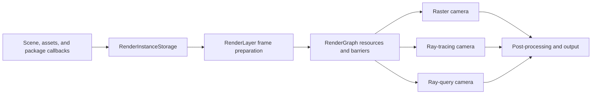
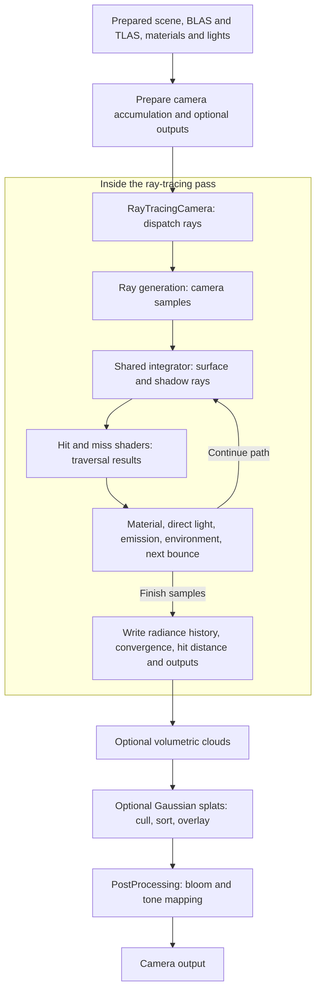
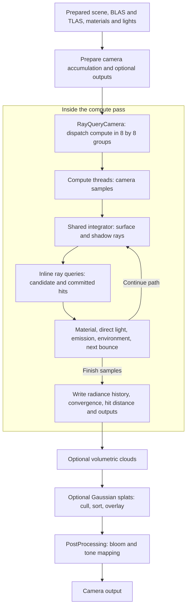
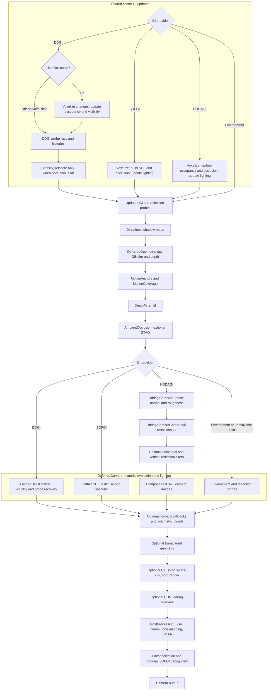

# EvoEngine Rendering

[Back to README](../README.md)

EvoEngine uses a Vulkan renderer built around `RenderLayer`. This page explains how scene data becomes a rendered camera
image and where each rendering responsibility lives.

Focused guides:

- [Materials and geometry](rendering-materials.md)
- [Texture access](rendering-texture-access.md)
- [Global illumination: DDGI, SDFGI, and HDDAGI](rendering-gi.md)
- [Reflection probes](reflection-probes.md)
- [Rendering demos](rendering-demos.md)
- [Rendering validation](rendering-validation.md)

## Architecture

### Image layouts and synchronization

First-party GPU images use `VK_IMAGE_LAYOUT_GENERAL`. New images transition from `UNDEFINED`; presentation uses
`PRESENT_SRC_KHR`. Render-graph declarations drive barriers and queue ownership even with equal layouts.
DDGI atlases are initialized before descriptor publication.

### Rendering flow

| Owner | Responsibility |
| --- | --- |
| `Camera` | View state, output texture, visible background, requested render technique, ray settings, and post-processing stack. |
| `Scene` | Renderable entities, lights, the main camera, environmental-lighting reference, and global reflection-probe fallback. |
| `EnvironmentalLighting` | Indirect GI provider, shared probe layout, DDGI/SDFGI/HDDAGI settings, environment source, reflection probes, and fallback intensities. |
| `RenderInstanceStorage` | Immutable per-frame GPU view of geometry, materials, transforms, lights, cameras, environment data, descriptors, and acceleration-structure inputs. |
| `RenderGraph` | Logical resources, pass ordering, access declarations, transient allocation, and Vulkan barrier planning. |
| `RenderLayer` | Pipeline creation, frame preparation, shadows, camera rendering, probe work, extension callbacks, diagnostics, and output handoff. |

Camera passes consume immutable snapshots. Static rigid renderers may reuse records; visibility, LOD, and draw lists
update each frame.

## Shader Source Policy

First-party shaders use `.slang` or `.slangh`, with modules and `import` for shared code. Legacy extensions, GLSL
compatibility syntax, and textual `#include` are rejected. Third-party `Extern/` code is exempt.

## Frame Flow

1. The application updates the project, scene, transforms, and layers.
2. `RenderLayer::PrepareForRendering` gathers render instances and resolves lighting state.
3. Geometry and textures complete pending uploads; acceleration structures and per-frame descriptors are prepared.
4. Shared work such as shadows, selected GI field updates, and reflection-probe captures is recorded.
5. Each camera executes its raster, ray-tracing, or ray-query graph.
6. Post-processing writes the final camera image for the editor, application window, render texture, or capture path.

Frame-slot fences keep transient resources and replaced renderer objects alive until submitted GPU work finishes.

## Static Scene Contract

`Scene::SetEntityStatic(entity, true)` enables record reuse for unchanged rigid meshes in a root hierarchy.
Skinned meshes, particles, strands, splats, external renderers, and API draws remain dynamic.

Scene/editor structural edits invalidate caches automatically. Code that directly changes a static transform or renderer
must call `RenderLayer::NotifyStaticEntityChanged(scene, entity)` afterward. Otherwise raster and ray inputs can remain
stale. Unchanged TLAS inputs reuse existing acceleration structures; changed inputs trigger the required build or update.

## Camera Techniques

| Technique | Rendering path | Availability behavior |
| --- | --- | --- |
| Rasterization | Raw opaque/masked GBuffer, fused compute material evaluation and lighting, forward/transparent rendering, then post-processing. | Always available. |
| Ray tracing | Vulkan ray-tracing pipeline running the shared path-tracing integrator. | Falls back to ray query when available, otherwise rasterization. |
| Ray query | Compute pipeline using inline ray queries with the shared path-tracing integrator. | Falls back to ray tracing when available, otherwise rasterization. |

The resolved technique is reported when it differs from the camera request. Ray tracing and ray query share material
evaluation, BSDF logic, environment and emissive sampling, path controls, debug views, and optional outputs. Only their
traversal adapters differ.

Ray cameras accumulate independently. Resizing, technique, settings, and scene changes invalidate affected histories;
unchanged cameras continue accumulating.

### Ray-tracing camera pass flow

### Ray-query camera pass flow

Each ray diagram expands one GPU camera pass; bounces and history writes are shader work within that pass.
Both modes use `CameraRayIntegrator`. They trace indirect lighting directly rather than gathering raster GI fields.
Optional outputs include albedo, normal, ray count, path length, timing, and debug data.

## Raster Path

### Raster camera pass flow

GI updates and point/spot shadows are shared across cameras. DDGI reuses HDDAGI's voxel visibility structures only with
occlusion enabled; it builds no SDF or HDDAGI transport history. Classification remains optional and independent.
`DeferredCamera` branches run within one pass; HDDAGI first prepares camera images. Disabled stages are skipped.
Reflection captures use a reduced, diffuse-only GI path.

Opaque geometry writes raw attributes and IDs; masked geometry additionally samples base-color alpha for coverage.
GTAO uses geometric normals before deferred compute evaluates materials, resolves the GBuffer, and combines direct
lighting, shadows, GI, reflection probes, and AO. Forward/transparent geometry follows, then optional overlays and
post-processing.

Persistent sampled assets and transient pass resources follow different descriptor policies. Standard material,
environment, and reflection-probe assets share bindless 2D and cubemap index spaces across raster and ray paths;
attachments, histories, and other pass-owned images retain explicit descriptors. See
[Texture access](rendering-texture-access.md) for the ownership rules and [Materials and geometry](rendering-materials.md)
for material behavior and geometry participation.

## Lighting

Direct lighting comes from directional, point, and spot lights. Environment and probe inputs are resolved from the scene
and its `EnvironmentalLighting` asset before rendering.

Choose Environment, Automatic DDGI, Automatic SDFGI (default), or Automatic HDDAGI. The selected automatic provider
updates a shared camera-anchored field; unsupported or unready coverage uses Environment fallback.
See [Global illumination](rendering-gi.md) for provider differences, controls, update passes, and known limitations.

| Use | Source and control |
| --- | --- |
| Visible primary background | The camera background source multiplied by `background_intensity`. |
| Raster diffuse indirect | Valid irradiance from the selected provider; otherwise the indirect environment source multiplied by `diffuse_fallback_intensity`. |
| Raster specular indirect | Selected GI, reflection probes, and environment fallback; local probes and SSR retain composition priority. |
| Ray-camera environment events | The indirect environment source multiplied by `environment_lighting_intensity`. |
| Reflection-probe capture background | The authored bake background, with inherited environment radiance multiplied by `environment_lighting_intensity`. |

All three environmental-lighting intensities default to `1.0`. Visible camera backgrounds are independent from indirect
lighting. Ray cameras do not use raster diffuse or specular fallback intensities, and they do not use the scene-global
prefiltered reflection probe as their environment radiance source.

## Shadows And Post-Processing

Directional lights use four cascades with Stable Sphere fitting by default; Tight Light-Space AABB fitting is available
for comparison. Directional shadows use Vogel-disc percentage-closer filtering. Point and spot lights use their own
shadow atlases and filtering paths. The quality override changes directional, point, and spot shadow-map resolution
together. Every shadow type separates opaque and alpha-masked rigid, meshlet, instanced, skinned, and strand casters.
Opaque depth shaders perform no material or texture access; masked depth shaders evaluate only base-color alpha
coverage. External shadow renderers register explicitly for one of those two contracts.

Raster cameras can use GTAO ambient occlusion, screen-space reflections, SMAA, bloom, tone mapping, and related post
effects from their `PostProcessingStack`. Ray cameras apply bloom and tone mapping after path tracing. Post-processing
resources and temporal histories are camera-owned. Assets must use the current flat GTAO and SMAA schemas.

Bloom's **Compression start** (2) and **Source ceiling** (8) bound sampled HDR contributions before downsampling,
preserving color ratios. They limit the bloom source, not the original scene color or final composited halo.

## Geometry And Optional Features

Regular, skinned, instanced, transparent, strand, Gaussian-splat, and externally registered geometry enter the renderer
through separate render-instance collections. Participation depends on the selected pass and the data supplied by the
renderer owner.

Strands use the mesh-shader raster path when supported. Ray cameras also include strands when the Vulkan device exposes
`VK_NV_ray_tracing_linear_swept_spheres` with `linearSweptSpheres`. Without that capability, strands are omitted from ray
tracing and ray query while raster strand rendering remains available. DDGI does not traverse strand geometry.

## Extending Rendering

Packages and services extend rendering through explicit APIs rather than by modifying built-in pass internals:

- register logical resources and frame- or camera-level render-graph passes;
- register external render instances and, when applicable, compatible acceleration-structure metadata;
- use raw opaque or alpha-only masked deferred callbacks, forward/transparent callbacks, explicit opaque or alpha-only
  masked shadow callbacks, and gizmo callbacks exposed by `RenderLayer`;
- provide package-owned shaders, descriptors, and resources for package-specific rendering.

External geometry participates only in the paths for which it supplies the required draw or traversal contract. For
example, DDGI requires compatible triangle acceleration-structure and offset data.

## Source Entry Points

Start with `RenderLayer`, `Camera`, `RenderGraph`, and `RenderInstanceStorage` in `EvoEngine_SDK`. Material and lighting
shader modules live under `EvoEngine_SDK/Internals/DefaultResources/Shaders/Modules/EvoEngine`.

The camera flows follow `RenderLayer::RenderToCamera`, `RenderLayer::RenderToCameraRayTracing`,
`HddagiCameraFrame::AddPasses`, and `PostProcessingStack::Process` / `ProcessRayCamera`.
