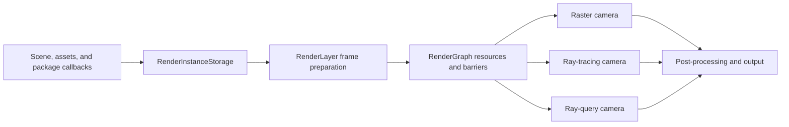

# EvoEngine Rendering

[Back to README](../README.md)

EvoEngine uses a Vulkan renderer built around `RenderLayer`. This page explains how scene data becomes a rendered camera
image and where each rendering responsibility lives.

Focused guides:

- [Materials and geometry](rendering-materials.md)
- [Texture access](rendering-texture-access.md)
- [Global illumination: DDGI, SDFGI, and HDDAGI](rendering-gi.md)
- [Reflection probes](reflection-probes.md)
- [Rendering demos](rendering-demos.md)
- [Rendering validation](rendering-validation.md)

## Architecture

### Image layouts and synchronization

First-party GPU images use `VK_IMAGE_LAYOUT_GENERAL`. New images transition from `UNDEFINED`; presentation uses
`PRESENT_SRC_KHR`. Render-graph declarations drive barriers and queue ownership even with equal layouts.
DDGI atlases are initialized before descriptor publication.

### Rendering flow

```mermaid
flowchart LR
  A[Scene, assets, and package callbacks] --> B[RenderInstanceStorage]
  B --> C[RenderLayer frame preparation]
  C --> D[RenderGraph resources and barriers]
  D --> E[Raster camera]
  D --> F[Ray-tracing camera]
  D --> G[Ray-query camera]
  E --> H[Post-processing and output]
  F --> H
  G --> H
```

| Owner | Responsibility |
| --- | --- |
| `Camera` | View state, output texture, visible background, requested render technique, ray settings, and post-processing stack. |
| `Scene` | Renderable entities, lights, the main camera, environmental-lighting reference, and global reflection-probe fallback. |
| `EnvironmentalLighting` | Indirect GI provider, shared probe layout, DDGI/SDFGI/HDDAGI settings, environment source, reflection probes, and fallback intensities. |
| `RenderInstanceStorage` | Immutable per-frame GPU view of geometry, materials, transforms, lights, cameras, environment data, descriptors, and acceleration-structure inputs. |
| `RenderGraph` | Logical resources, pass ordering, access declarations, transient allocation, and Vulkan barrier planning. |
| `RenderLayer` | Pipeline creation, frame preparation, shadows, camera rendering, probe work, extension callbacks, diagnostics, and output handoff. |

Camera passes consume immutable snapshots. Static rigid renderers may reuse records; visibility, LOD, and draw lists
update each frame.

## Shader Source Policy

First-party shaders use `.slang` or `.slangh`, with modules and `import` for shared code. Legacy extensions, GLSL
compatibility syntax, and textual `#include` are rejected. Third-party `Extern/` code is exempt.

## Frame Flow

1. The application updates the project, scene, transforms, and layers.
2. `RenderLayer::PrepareForRendering` gathers render instances and resolves lighting state.
3. Geometry and textures complete pending uploads; acceleration structures and per-frame descriptors are prepared.
4. Shared work such as shadows, selected GI field updates, and reflection-probe captures is recorded.
5. Each camera executes its raster, ray-tracing, or ray-query graph.
6. Post-processing writes the final camera image for the editor, application window, render texture, or capture path.

Frame-slot fences keep transient resources and replaced renderer objects alive until submitted GPU work finishes.

## Static Scene Contract

`Scene::SetEntityStatic(entity, true)` enables record reuse for unchanged rigid meshes in a root hierarchy.
Skinned meshes, particles, strands, splats, external renderers, and API draws remain dynamic.

Scene/editor structural edits invalidate caches automatically. Code that directly changes a static transform or renderer
must call `RenderLayer::NotifyStaticEntityChanged(scene, entity)` afterward. Otherwise raster and ray inputs can remain
stale. Unchanged TLAS inputs reuse existing acceleration structures; changed inputs trigger the required build or update.

## Camera Techniques

| Technique | Rendering path | Availability behavior |
| --- | --- | --- |
| Rasterization | Raw opaque/masked GBuffer, fused compute material evaluation and lighting, forward/transparent rendering, then post-processing. | Always available. |
| Ray tracing | Vulkan ray-tracing pipeline running the shared path-tracing integrator. | Falls back to ray query when available, otherwise rasterization. |
| Ray query | Compute pipeline using inline ray queries with the shared path-tracing integrator. | Falls back to ray tracing when available, otherwise rasterization. |

The resolved technique is reported when it differs from the camera request. Ray tracing and ray query share material
evaluation, BSDF logic, environment and emissive sampling, path controls, debug views, and optional outputs. Only their
traversal adapters differ.

Ray cameras accumulate independently. Resizing, technique, settings, and scene changes invalidate affected histories;
unchanged cameras continue accumulating.

### ReSTIR PT ray integrators

Under **Ray Integrator**, choose **Path Tracing**, **ReSTIR PT Candidate Only**, **ReSTIR PT Spatial Only**,
**ReSTIR PT Temporal Only**, or **ReSTIR PT Enhanced**.
ReSTIR uses compute shaders with inline RayQuery. Candidate Only samples a path reservoir; Spatial Only also replays
candidates at reciprocal neighboring pixels and sums their pairwise MIS-weighted RGB contributions. It uses no
previous-frame reservoirs. Spatial resolve stores only the 16-byte RGB result; with 1–16 pairs, ReSTIR uses 224–704
bytes per pixel for its candidate, surface, shift, and resolved buffers.
ReSTIR material texture gradients grow with ray travel distance. After diffuse or glossy scattering, a capped
roughness-aware cone spread carries that footprint along later path segments; sharp specular paths retain their
existing detail. Alpha, shadow, and emissive visibility sampling remains at its existing LOD.
Changing the integrator or reuse settings resets accumulation.

**Temporal history cap** in Temporal Only and Enhanced limits the effective count credited to a reused previous-frame
reservoir. It is adjustable from 1 to 32 and defaults to 20. New cameras enable **Adaptive duplication cap** by default; saved camera
settings retain their explicit value. The duplication map lowers the cap toward 1 where neighboring pixels share a path
seed. In a matched 1920x1080 Sponza Enhanced capture after 1024 accumulated frames, enabling it changed mean linear
luminance by -0.10% and left the brightest pixels in the same locations. On a separate 256x144 static indirect fixture
without accumulation, it lost about 24%
mean brightness after 1024 frames; the uniform cap stayed within 3% of a PT4096 reference. Lower caps can shorten
persistent fireflies but may add variance. Preview captures can set the cap with
`--preview-restir-temporal-history-cap 1` or disable the adaptive policy with
`--preview-restir-temporal-adaptive-cap disabled`. Uniform mode skips the duplication GPU pass and binds a four-byte
buffer instead of a full-resolution duplication map; the profile's storage estimate excludes that small buffer.

Temporal Only adds a previous-frame reservoir, surface reprojection, optional duplication-aware temporal confidence,
forward and backward replay shifts, and a history resolve without spatial pairs. Enhanced also adds count-aware spatial
resampling. Both Spatial Only and Enhanced use reciprocal paper-scale reuse maps with approximately 16-pixel Gaussian
offsets. Spatial pairs use material, normal, planar-distance, and
world-distance checks. Temporal Only and Enhanced retain reservoir history across camera motion and rigid mesh
transforms using previous-instance matrices, while restarting radiance accumulation. Other scene changes clear history.
Both temporal modes store screen motion with each primary surface and use the prior occluder's motion as a fallback when
direct history reprojection fails. In an earlier Enhanced eight-frame continuous camera-motion fixture at 256×144,
this estimate supplied 151 valid forward shifts; single-step motion fixtures did not exercise it. Both temporal modes
remain experimental. With Enhanced's optional **Temporal hybrid shifts** enabled, eligible static opaque paths reconnect at the second vertex
for three-vertex diffuse-to-emissive paths, or at the first footprint-selected vertex on longer non-delta NEE and
BSDF-terminated emissive or environment paths. Longer NEE and BSDF paths also reconnect when that vertex immediately
precedes an emissive or environment endpoint; punctual endpoints use NEE. Eligible temporal and spatial shifts replay
the camera prefix, evaluate the target BSDF and connection visibility, and retain a refreshed cached Jacobian on
shifted winners. Masked, blended, and transmissive materials may coexist in the scene; reconnection paths must use
opaque surfaces. `k=d` endpoint paths and other unsupported reconnections use full replay. Hybrid shifts remain
incomplete for moving reconnection geometry and delta, transmission, or volume events. A 256×144 masked-roulette capture improves
equal-frame error but fails the equal-GPU-time quality gate; quality across scenes remains unverified.
Preview captures select temporal reuse with `--preview-ray-integrator temporal` or `enhanced` and include
`restir_pt_temporal` diagnostics in the ray profile report.
When accumulating samples, Temporal Only and Enhanced preserve each fresh candidate's radiance and replace unusually
bright resolved pixels with that fresh sample. They also randomly shade the fresh sample on an increasing fraction of pixels as
accumulation proceeds, reaching 50% after 160 accumulated samples. This reduces correlation from paths that persist in
the reservoir. The local outlier threshold uses the camera's **Firefly Clamp** value; setting it to zero disables
replacement, decorrelation, and the global clamp. Both temporal modes allocate 16 extra bytes per pixel per frame in
flight while these features are active.

**Spatial neighbors** selects 1–16 pairs per pixel and defaults to 3, matching the ReSTIR PT Enhanced paper's
spatial-pair count. Each pair has a distinct reciprocal reuse map. More pairs cost more GPU time and shift-buffer
memory; quality above three pairs has not passed an equal-GPU-time gate. In earlier matched Sponza trials, paper-scale
pairs increased near-black fresh-frame pixels and image error relative to the former shorter-range and local patterns.
**Hybrid shifts** is off by default in Spatial Only. It reconnects eligible three-vertex diffuse
emissive-light paths; other paths use full replay, including paths that traverse transmission.
Preview captures accept `--preview-restir-spatial-neighbors 1..16` and
`--preview-restir-spatial-hybrid enabled|disabled`. The latter selects temporal hybrid shifts in Enhanced mode.

**Accumulate Samples** averages radiance across frames by default. Disable it for a fresh random sample each frame;
same-frame spatial reuse still works. Preview captures use `--preview-accumulate-samples enabled|disabled`.
Spatial Only, Temporal Only, and Enhanced require one sample per frame. ReSTIR modes do not support Auto SPP with accumulation enabled;
ray debug views must be off.
Temporal Only specializes its candidate and temporal replay shaders for the scene's material features in the background.
The all-feature shaders render until the specialized pipelines are ready; activation resets temporal history.
Temporal replay evaluates the matched path contribution and primary surface without selecting another reservoir;
spatial replay still selects a reservoir for its pairwise weight.
With NRD disabled, Temporal Only also switches its candidate, combine, and resolve passes together to variants that omit
NRD signal work. NRD-enabled rendering keeps the signal-producing shaders.
All six optional ray outputs are available in ReSTIR modes. They describe locally traced candidate paths before
temporal or spatial reuse: albedo and signed world-space normal come from the first primary hit. The normal image's
alpha stores linear roughness (the geometric mean of anisotropic roughness axes, or 1 for a miss). Ray count and path
length cover candidate tracing, and debug shows candidate radiance rather than the resolved reused result. Time currently
reports zero, as it does for Path Tracing. Unsupported scene features leave ReSTIR unavailable without switching
integrators.
The standard Windows build includes optional camera NRD denoising; its input contract and remaining quality work are described in [ray-camera denoising](ray-camera-denoising.md).

Supported paths include triangle meshes (instanced, skinned, and alpha masked), device-supported linear swept sphere
strands, unlit surfaces, environment and emissive lighting, punctual lights, specular reflection, thin and closed
transmission, absorption, and homogeneous scattering. Dispersion and Gaussian splats are unavailable. Spatial Only
has not passed the equal-GPU-time quality gate against conventional RayQuery Path Tracing.

Preview captures can write `--preview-ray-profile-report <path>.json` with per-pair shift outcomes, ray counts, and a
`*-shift.ppm` heatmap. The heatmap shows the first pair; JSON covers every pair. Add
`--preview-restir-generated-profile` to record candidate path types and target weights. The
Enhanced report also records the 32 brightest pixels in the final unaccumulated ReSTIR radiance buffer, with their
reservoir seed, path type, effective count, selected weight, and target density. Its pixel coordinates match the saved
HDR image.
The `restir-diffuse-visible`, `restir-diffuse-occluded`, `restir-glossy`, `restir-roulette`, `restir-mixed-roulette`,
`restir-mixed`, `restir-edges`, and `restir-indirect-upward` fixtures exercise spatial reuse.
`restir-indirect-upward-textured` adds a minified opaque ceiling texture for reconnection LOD checks.
`restir-indirect-upward-moving` animates the indirect ceiling for temporal reconnection checks;
`restir-indirect-upward-static-pose` holds its frame-64 pose for path-tracing comparisons.
Use `--preview-fixture-advance-after-frame 0` to reset the moving fixture at capture start.

### Ray-camera pass flow

Ray-tracing cameras dispatch a ray-generation pipeline; ray-query cameras dispatch compute threads using inline ray
queries. Both call `CameraRayIntegrator` for materials, light sampling, bounces, and accumulation, then run optional
volumetric clouds, Gaussian splats, and post-processing. Ray cameras trace indirect lighting directly and can output
albedo, normals, ray counts, path lengths, timing, and debug data.

## Raster Path

### Raster camera pass flow

The selected DDGI, SDFGI, or HDDAGI provider updates its shared field before camera rendering. The camera graph then
records shadows, raw GBuffer and depth, motion vectors, depth pyramid, optional GTAO, deferred material evaluation and
lighting, forward and transparent geometry, optional splats and overlays, and post-processing. HDDAGI prepares
full-resolution camera GI images before deferred composition.

GI updates and point/spot shadows are shared across cameras. DDGI reuses HDDAGI's voxel visibility structures only with
occlusion enabled; it builds no SDF or HDDAGI transport history. Classification remains optional and independent.
`DeferredCamera` branches run within one pass; HDDAGI first prepares camera images. Disabled stages are skipped.
Reflection captures use a reduced, diffuse-only GI path.

Opaque geometry writes raw attributes and IDs; masked geometry additionally samples base-color alpha for coverage.
GTAO uses geometric normals before deferred compute evaluates materials, resolves the GBuffer, and combines direct
lighting, shadows, GI, reflection probes, and AO. Forward/transparent geometry follows, then optional overlays and
post-processing.

Persistent sampled assets and transient pass resources follow different descriptor policies. Standard material,
environment, and reflection-probe assets share bindless 2D and cubemap index spaces across raster and ray paths;
attachments, histories, and other pass-owned images retain explicit descriptors. See
[Texture access](rendering-texture-access.md) for the ownership rules and [Materials and geometry](rendering-materials.md)
for material behavior and geometry participation.

## Lighting

Direct lighting comes from directional, point, and spot lights. Environment and probe inputs are resolved from the scene
and its `EnvironmentalLighting` asset before rendering.

Choose Environment, Automatic DDGI, Automatic SDFGI (default), or Automatic HDDAGI. The selected automatic provider
updates a shared camera-anchored field; unsupported or unready coverage uses Environment fallback.
See [Global illumination](rendering-gi.md) for provider differences, controls, update passes, and known limitations.

| Use | Source and control |
| --- | --- |
| Visible primary background | The camera background source multiplied by `background_intensity`. |
| Raster diffuse indirect | Valid irradiance from the selected provider; otherwise the indirect environment source multiplied by `diffuse_fallback_intensity`. |
| Raster specular indirect | Selected GI, reflection probes, and environment fallback; local probes and SSR retain composition priority. |
| Ray-camera environment events | The indirect environment source multiplied by `environment_lighting_intensity`. |
| Reflection-probe capture background | The authored bake background, with inherited environment radiance multiplied by `environment_lighting_intensity`. |

All three environmental-lighting intensities default to `1.0`. Visible camera backgrounds are independent from indirect
lighting. Ray cameras do not use raster diffuse or specular fallback intensities, and they do not use the scene-global
prefiltered reflection probe as their environment radiance source.

## Shadows And Post-Processing

Directional lights use four cascades with Stable Sphere fitting by default; Tight Light-Space AABB fitting is available
for comparison. Directional shadows use Vogel-disc percentage-closer filtering. Point and spot lights use their own
shadow atlases and filtering paths. The quality override changes directional, point, and spot shadow-map resolution
together. Every shadow type separates opaque and alpha-masked rigid, meshlet, instanced, skinned, and strand casters.
Opaque depth shaders perform no material or texture access; masked depth shaders evaluate only base-color alpha
coverage. External shadow renderers register explicitly for one of those two contracts.

Raster cameras can use GTAO ambient occlusion, screen-space reflections, SMAA, bloom, tone mapping, and related post
effects from their `PostProcessingStack`. Ray cameras apply bloom and tone mapping after path tracing. Post-processing
resources and temporal histories are camera-owned. Assets must use the current flat GTAO and SMAA schemas.

Bloom's **Compression start** (2) and **Source ceiling** (8) bound sampled HDR contributions before downsampling,
preserving color ratios. They limit the bloom source, not the original scene color or final composited halo.

## Geometry And Optional Features

Regular, skinned, instanced, transparent, strand, Gaussian-splat, and externally registered geometry enter the renderer
through separate render-instance collections. Participation depends on the selected pass and the data supplied by the
renderer owner.

Strands use the mesh-shader raster path when supported. Ray cameras also include strands when the Vulkan device exposes
`VK_NV_ray_tracing_linear_swept_spheres` with `linearSweptSpheres`. Without that capability, strands are omitted from ray
tracing and ray query while raster strand rendering remains available. DDGI does not traverse strand geometry.

## Extending Rendering

Packages and services extend rendering through explicit APIs rather than by modifying built-in pass internals:

- register logical resources and frame- or camera-level render-graph passes;
- register external render instances and, when applicable, compatible acceleration-structure metadata;
- use raw opaque or alpha-only masked deferred callbacks, forward/transparent callbacks, explicit opaque or alpha-only
  masked shadow callbacks, and gizmo callbacks exposed by `RenderLayer`;
- provide package-owned shaders, descriptors, and resources for package-specific rendering.

External geometry participates only in the paths for which it supplies the required draw or traversal contract. For
example, DDGI requires compatible triangle acceleration-structure and offset data.

## Source Entry Points

Start with `RenderLayer`, `Camera`, `RenderGraph`, and `RenderInstanceStorage` in `EvoEngine_SDK`. Material and lighting
shader modules live under `EvoEngine_SDK/Internals/DefaultResources/Shaders/Modules/EvoEngine`.

The camera flows follow `RenderLayer::RenderToCamera`, `RenderLayer::RenderToCameraRayTracing`,
`HddagiCameraFrame::AddPasses`, and `PostProcessingStack::Process` / `ProcessRayCamera`.
